Posture Project
================
Giovani Gutierrez
2023-03-31

- <a href="#1-introduction" id="toc-1-introduction">1 Introduction</a>
  - <a href="#11-the-goal" id="toc-11-the-goal">1.1 The Goal</a>
  - <a href="#12-the-data" id="toc-12-the-data">1.2 The Data</a>
  - <a href="#13-introvert-or-extrovert"
    id="toc-13-introvert-or-extrovert">1.3 Introvert or Extrovert?</a>
  - <a href="#14-measuring-posture" id="toc-14-measuring-posture">1.4
    Measuring Posture</a>
- <a href="#2-getting-started" id="toc-2-getting-started">2 Getting
  Started</a>
  - <a href="#21-setup" id="toc-21-setup">2.1 Setup</a>
  - <a href="#22-import-data" id="toc-22-import-data">2.2 Import Data</a>
  - <a href="#23-tidy-data--missing-values"
    id="toc-23-tidy-data--missing-values">2.3 Tidy Data &amp; Missing
    Values</a>
- <a href="#3-exploratory-data-analysis-eda"
  id="toc-3-exploratory-data-analysis-eda">3 Exploratory Data Analysis
  (EDA)</a>
  - <a href="#31-code-book" id="toc-31-code-book">3.1 Code-book</a>
  - <a href="#32-correlation-between-features"
    id="toc-32-correlation-between-features">3.2 Correlation Between
    Features</a>
  - <a href="#33-visual-eda" id="toc-33-visual-eda">3.3 Visual EDA</a>
- <a href="#4-model-setup" id="toc-4-model-setup">4 Model Setup</a>
  - <a href="#41-data-split--k-fold-cross-validation"
    id="toc-41-data-split--k-fold-cross-validation">4.1 Data Split &amp;
    <em>k</em>-Fold Cross Validation</a>
  - <a href="#42-recipe-building" id="toc-42-recipe-building">4.2 Recipe
    Building</a>
  - <a href="#43-model-specifications" id="toc-43-model-specifications">4.3
    Model Specifications</a>
    - <a href="#431-random-forest" id="toc-431-random-forest">4.3.1 Random
      Forest</a>
    - <a href="#432-k-nearest-neighbors"
      id="toc-432-k-nearest-neighbors">4.3.2 K-Nearest Neighbors</a>
    - <a href="#433-elastic-net-logistic-regression"
      id="toc-433-elastic-net-logistic-regression">4.3.3 Elastic-Net Logistic
      Regression</a>
    - <a href="#434-linear-support-vector-machines"
      id="toc-434-linear-support-vector-machines">4.3.4 Linear Support Vector
      Machines</a>
- <a href="#5-model-tuning--evaluation"
  id="toc-5-model-tuning--evaluation">5 Model Tuning &amp; Evaluation</a>
  - <a href="#51-workflow-sets" id="toc-51-workflow-sets">5.1 Workflow
    Sets</a>
  - <a href="#52-workflow-map--tuning" id="toc-52-workflow-map--tuning">5.2
    Workflow Map &amp; Tuning</a>
  - <a href="#53-evaluation-of-models" id="toc-53-evaluation-of-models">5.3
    Evaluation of Models</a>
- <a href="#6-final-evaluation--concluding-remarks"
  id="toc-6-final-evaluation--concluding-remarks">6 Final Evaluation &amp;
  Concluding Remarks</a>
  - <a href="#61-model-evaluation-on-testing-data"
    id="toc-61-model-evaluation-on-testing-data">6.1 Model Evaluation on
    Testing Data</a>
  - <a href="#62-concluding-remarks" id="toc-62-concluding-remarks">6.2
    Concluding Remarks</a>
- <a href="#7-references" id="toc-7-references">7 References</a>

# 1 Introduction

## 1.1 The Goal

What do posture, personality, age, and height have in common? I have no
idea, but that’s what we are here for! The overall goal of this project
is to explore the possibility of classifying a person as an introvert or
extrovert based on multiple features using statistical/machine learning
methods. While we won’t be exploring the exact relationships between
posture, personality, and other features, feel free to read the
[following study](https://doi.org/10.1371/journal.pone.0037450)
conducted by Sylvain Guimond (San Diego University for Integrative
Studies) and Wael Massrieh (McGill University).

## 1.2 The Data

Our data is from the aforementioned study/research article (Guimond and
Massrieh 2012). While there were many features collected during the
study, two are of heightened interest: a participant’s posture and a
participant’s personality type. We will explore more of the features
when we actually explore our data.

## 1.3 Introvert or Extrovert?

How do we tell if someone is an introvert or extrovert? The easiest way
would be to simply ask someone. However, this is not very “scientific”
approach. Another way is to use the popular and well-known [Myers-Briggs
Type
Indicator](https://www.myersbriggs.org/my-mbti-personality-type/mbti-basics/)
(MBTI) instrument which is used for the identification of basic
preferences of each of the four dichotomies specified by C. G. Jung.
Additionally, it is used for the identification of the 16 distinctive
personality types.

<center>

<figure>
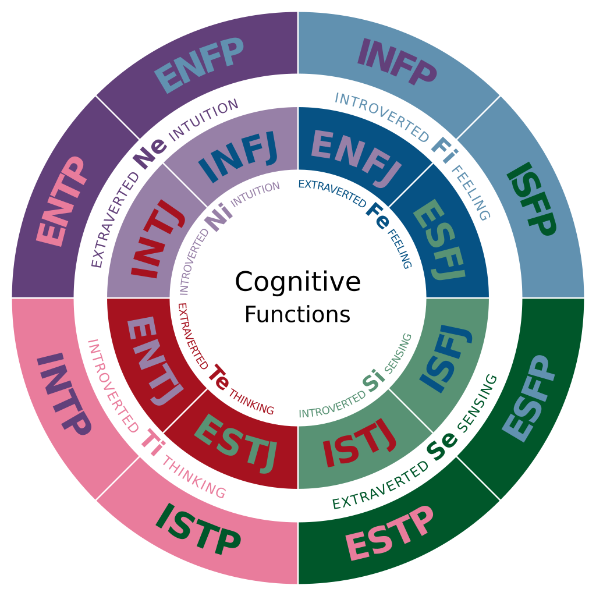
<figcaption aria-hidden="true">A diagram depicting the cognitive
functions of each type: A type’s background color represents its
dominant function and its text color represents its auxiliary
function.</figcaption>
</figure>

</center>

Each participant in the study above was given the an MBTI questionnaire
and given instructions on how to properly go about the 93-question test.
The results from the personality inventory (MBTI) came in the form of a
combination of letters $$Extraversion, Introversion, Sensing, Intuition,
Thinking, Feeling, Judging, and Perceiving$$, and numbers, 1-26.

## 1.4 Measuring Posture

A participant’s posture was measured using the [BioPrint
system](https://biotonix.com/en/), which is a bio-mechanical assessment
of posture. Each subject had 32 reflective markers placed on key
anatomical landmarks. Photographs were then taken by the BioPrint
system. Each subject was assigned a different letter indicating their
type of posture: ideal posture (A), kyphosis-lordosis (B), flat back
(C), sway-back (D).

<center>

<figure>
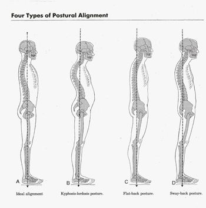
<figcaption aria-hidden="true">The four major posture types according to
F. P. Kendall and E. K. McCreary.</figcaption>
</figure>

</center>

# 2 Getting Started

## 2.1 Setup

We first start by loading all the necessary packages. We also call the
function `tidymodels_prefer()` to handle common conflicts between
[tidymodels](https://www.tidymodels.org/) and other packages. We also
set a nice theme for our plots. Finally, we set our seed for
reproducibility.

``` r
library(tidyverse)
library(tidymodels)
library(readxl)
library(janitor)
library(visdat)
library(naniar)
library(corrr)
library(patchwork)
library(glmnet)
library(kknn)
library(ranger)
library(vip)
library(kernlab)
library(GGally)

tidymodels_prefer()
theme_set(theme_bw())

set.seed(123)  # set seed
```

## 2.2 Import Data

Our data, from the study, comes in a .xls format. We read in the data
using `read_xls()` and use the `clean_names()` function to make the
column/variable names more digestible. We save the data as `data1`. I
have saved the raw data as a .csv file to more easily view and import
the data, if needed. Now, let’s preview our data to see what we have.

``` r
data1 <- read_xls("Data/Posture_Data.xls") %>%
    clean_names()  # read in raw data from .xls file

data1 %>%
    write.csv(file = "Data/raw_data.csv")  # write raw data to .csv file

head(data1)  # preview data
```

<div class="kable-table">

| number_1 | age | height | weight | sex    | activity_level | pain_1 | pain_2 | pain_3 | pain_4 | mbti | e   | i   | s   | n   | t   | f   | j   | p   | posture | number_21 | l1  | l2_d               | l3  | l4_d | l5  | l6_d | l7  | l8_d | l9  | l10_d              | l11 | l12_i | l13 | l14_i               | l15 | l16_i | l17 | l18_i | l19 | l20_i | l21 | l22_i | l23 | l24_i               | l25_i |  l26 | l27 | l28 | l29 | l30                |  l31 |   l32 | l33                 | l34 | l35 |    l36 |   l37 | l38 | l39 | l40 | l41 | l42 | l43 | l44 | l45 |
|:---------|----:|-------:|-------:|:-------|:---------------|:-------|:-------|:-------|:-------|:-----|:----|:----|:----|:----|:----|:----|:----|:----|:--------|:----------|:----|:-------------------|:----|-----:|:----|-----:|:----|-----:|:----|:-------------------|:----|------:|:----|:--------------------|:----|------:|:----|------:|:----|------:|:----|------:|:----|:--------------------|------:|-----:|----:|----:|:----|:-------------------|-----:|------:|:--------------------|----:|:----|-------:|------:|:----|:----|:----|:----|:----|:----|:----|:----|
| 1        |  53 |     62 |    125 | Female | Low            | 0      | 0      | 0      | 0      | ESFJ | 18  | 3   | 17  | 9   | 9   | 13  | 18  | 4   | A       | 1         | A   | 4.7000000000000002 | A   |  3.3 | A   |  5.3 | P   |  2.6 | A   | 12.0               | A   |   1.3 | A   | 0.90000000000000002 | A   |   0.0 | A   |   0.5 | P   |   0.5 | L   |   0.5 | A   | 0.59999999999999998 |   0.8 | 10.1 | 0.4 | 0.4 | P   | 56.100000000000001 | 12.6 |  72.3 | 0.29999999999999999 | 2.1 | P   | 364.10 |  81.8 | NA  | NA  | NA  | NA  | NA  | NA  | NA  | NA  |
| 3        |  30 |     69 |    200 | Male   | High           | 0      | 0      | 0      | 0      | ESTJ | 15  | 6   | 16  | 10  | 15  | 9   | 12  | 10  | A       | 3         | A   | 27.300000000000001 | P   |  5.2 | P   |  0.3 | A   |  3.8 | A   | 12                 | A   |   2.7 | A   | 0.0                 | A   |   1.4 | A   |   0.9 | A   |   1.0 | NA  |   0.0 | A   | 0.69999999999999996 |   0.7 | 16.2 | 2.7 | 4.9 | P   | 194.80000000000001 | 43.8 | 115.6 | 0.10000000000000001 | 1.2 | A   | 537.60 | 120.8 | X   | NA  | NA  | NA  | NA  | NA  | NA  | NA  |
| 5        |  45 |     63 |    199 | Female | Moderate       | 4      | 5      | 2      | 2      | ENFJ | 14  | 7   | 20  | 6   | 9   | 15  | 16  | 6   | A       | 5         | A   | 2.5                | A   |  2.0 | A   |  2.6 | A   |  1.4 | A   | 20.100000000000001 | A   |   1.0 | A   | 0.90000000000000002 | A   |   0.3 | A   |   1.0 | A   |   0.3 | NA  |   0.0 | A   | 0.80000000000000004 |   0.8 | 16.1 | 0.2 | 0.3 | P   | 79.900000000000006 | 18.0 | 115.0 | 0                   | 0.4 | A   | 520.10 | 116.9 | NA  | NA  | NA  | NA  | NA  | X   | X   | X   |
| 15       |  30 |     69 |    190 | Male   | Moderate       | 0      | 0      | 4      | 7      | ESTP | 20  | 1   | 22  | 4   | 13  | 11  | 7   | 15  | A       | 16        | A   | 8.5                | A   |  4.0 | A   |  2.0 | P   |  1.5 | A   | 15.300000000000001 | A   |   1.8 | A   | 1.1000000000000001  | P   |   0.0 | A   |   0.1 | P   |   0.3 | L   |   0.1 | A   | 0.5                 |   0.5 | 15.4 | 0.7 | 1.1 | P   | 96.090000000000003 | 21.8 | 109.8 | 0.59999999999999998 | 7.4 | P   | 637.10 | 143.2 | NA  | NA  | NA  | NA  | NA  | NA  | NA  | NA  |
| 17       |  59 |     66 |    138 | Female | Low            | 6      | 3      | 6      | 6      | ESTJ | 12  | 9   | 18  | 8   | 14  | 10  | 20  | 2   | A       | 19        | A   | 0.5                | P   |  1.1 | A   |  0.3 | A   |  4.0 | A   | 12.1               | A   |   0.4 | A   | 0.40000000000000002 | A   |   0.7 | A   |   1.0 | A   |   0.9 | L   |   0.5 | A   | 0.59999999999999998 |   0.8 | 11.2 | 0.0 | 0.1 | P   | 51.100000000000001 | 11.5 |  79.8 | 0.29999999999999999 | 2.9 | A   | 412.00 |  92.6 | NA  | NA  | NA  | NA  | NA  | NA  | NA  | NA  |
| 27       |  36 |     68 |    165 | Male   | High           | 0      | 2      | 0      | 0      | ESTP | 16  | 5   | 20  | 6   | 15  | 9   | 7   | 15  | A       | 29        | A   | 14                 | P   |  2.6 | A   |  1.6 | A   |  1.0 | A   | 14.199999999999999 | A   |   1.2 | P   | 0.10000000000000001 | A   |   0.6 | A   |   0.6 | A   |   0.2 | L   |   0.2 | A   | 0.40000000000000002 |   0.4 | 13.4 | 1.3 | 1.9 | P   | 107.59999999999999 | 24.2 |  95.4 | 0.20000000000000001 | 2.3 | A   | 469.05 | 105.5 | X   | NA  | NA  | NA  | NA  | NA  | NA  | NA  |

</div>

``` r
dim(data1)  # number of rows & columns
```

    ## [1] 100  66

Everything went well in importing our data! Using the `dim()` function,
we have $66$ columns (or variables) and $100$ observations (or rows).

## 2.3 Tidy Data & Missing Values

Time to tidy-up our data! First, looking at the data, there are values
that are represented with the character “X”. These represent missing
values. Let’s replace these characters with `NA` values. After, we can
take a look to see what proportion of our data is missing.

``` r
data1 <- data1 %>%
    replace_with_na_all(condition = ~.x == "X")  # replace 'X' character values with NA values

data1 %>%
    vis_miss()  # visualize missing values
```


Notice all the missing values in our data. About 12.9% of the data is
missing. Variables `l1` through `l45` are specific results for certain
areas of the body from the posture evaluation. A lot of these values are
missing but these values are very specific to each participant, so we
will drop these variables. After dropping those variables, out of the
100 participants, 3 participants have missing data pertaining to their
personality. We will drop these three observations as well:

``` r
data1 <- data1 %>%
    select(age:posture & -mbti) %>%
    drop_na()  # drop missing and irrelevant variables
```

Now we will convert our variables to more fitting types. We coerce `sex`
and `posture` to factors, `activity_level` to an ordered factor, and all
the variables pertaining to pain and personality (except for `e` and
`i`) to numeric variables. Additionally, we will compare each
participant’s extrovert score against their introvert score. If their
extrovert score is higher, then the participant will be assigned
‘Extrovert’. The opposite is true if their introvert score is higher.
These assignments are factors in a newly created variable `e_i`. We
won’t need the actual introvert/extrovert score after this new variable
is created, so we will drop the numeric scores:

``` r
data1 <- data1 %>%
    mutate(sex = factor(sex)) %>%
    mutate(
        activity_level = ordered(activity_level, levels = c("Low", "Moderate", "High"))
    ) %>%
    mutate_at(
        c("pain_1", "pain_2", "pain_3", "pain_4"),
        as.numeric
    ) %>%
    mutate(e_i = factor(ifelse(e > i, "Extrovert", "Introvert"))) %>%
    mutate_at(
        c("s", "n", "t", "f", "j", "p"),
        as.numeric
    ) %>%
    mutate(posture = factor(posture)) %>%
    select(-e & -i)  # coerce variables into appropriate type
```

Let’s visualize our variable types to check to see if anything went
wrong:

``` r
data1 %>%
    vis_dat() + scale_fill_brewer(palette = "Pastel1")  # visualize variable types
```

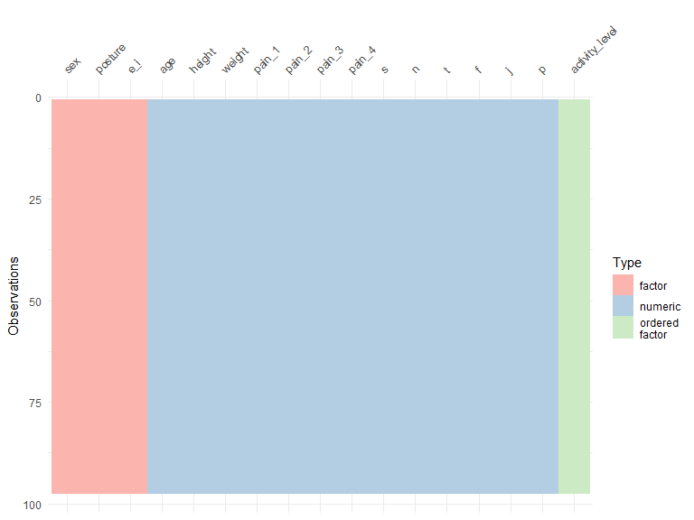

Everything looks good!

We’ll write our tidied data to a .csv file. Let’s also preview our
tidied data:

``` r
data1 %>%
    write.csv(file = "Data/clean_data.csv")  # write clean data to .csv file

head(data1)  # preview tidied data
```

<div class="kable-table">

| age | height | weight | sex    | activity_level | pain_1 | pain_2 | pain_3 | pain_4 |   s |   n |   t |   f |   j |   p | posture | e_i       |
|----:|-------:|-------:|:-------|:---------------|-------:|-------:|-------:|-------:|----:|----:|----:|----:|----:|----:|:--------|:----------|
|  53 |     62 |    125 | Female | Low            |      0 |      0 |      0 |      0 |  17 |   9 |   9 |  13 |  18 |   4 | A       | Introvert |
|  30 |     69 |    200 | Male   | High           |      0 |      0 |      0 |      0 |  16 |  10 |  15 |   9 |  12 |  10 | A       | Introvert |
|  45 |     63 |    199 | Female | Moderate       |      4 |      5 |      2 |      2 |  20 |   6 |   9 |  15 |  16 |   6 | A       | Introvert |
|  30 |     69 |    190 | Male   | Moderate       |      0 |      0 |      4 |      7 |  22 |   4 |  13 |  11 |   7 |  15 | A       | Extrovert |
|  59 |     66 |    138 | Female | Low            |      6 |      3 |      6 |      6 |  18 |   8 |  14 |  10 |  20 |   2 | A       | Introvert |
|  36 |     68 |    165 | Male   | High           |      0 |      2 |      0 |      0 |  20 |   6 |  15 |   9 |   7 |  15 | A       | Introvert |

</div>

# 3 Exploratory Data Analysis (EDA)

## 3.1 Code-book

Here are each of the variables we will be using for our model:

- `age`: Age of participant (in years).
- `height`: Height of participant (in inches).
- `weight`: Weight of participant (in pounds).
- `sex`: Sex of the participant (male or female).
- `activity_level`: Amount of daily physical activity performed by a
  participant (low, moderate, or high).
- `pain_1`: Pain in the neck reported on a scale from 0 (low) to 10
  (high) by a participant.
- `pain_2`: Pain in the thoracic reported on a scale from 0 (low) to 10
  (high) by a participant.
- `pain_3`: Pain in the lumbar reported on a scale from 0 (low) to 10
  (high) by the participant.
- `pain_4`: Pain in the sacrum reported on a scale from 0 (low) to 10
  (high) by the participant.
- `s`: A participant’s sensing characteristic on a scale from 1 (low) to
  26 (high).
- `i`: A participant’s intuition characteristic on a scale from 1 (low)
  to 26 (high).
- `t`: A participant’s thinking characteristic on a scale from 1 (low)
  to 26 (high).
- `f`: A participant’s feeling characteristic on a scale from 1 (low) to
  26 (high).
- `j`: A participant’s judging characteristic on a scale from 1 (low) to
  26 (high).
- `p`: A participant’s perceiving characteristic on a scale from 1 (low)
  to 26 (high).
- `posture`: Type of posture exhibited by a participant (ideal posture =
  ‘A’, kyphosis-lordosis = ‘B’, flat-back = ‘C’, and sway-back = ‘D’).
- `e_i`: Categorization of participant as an extrovert or introvert
  based on whichever score was higher on their MBTI questionnaire; the
  outcome of our model.

## 3.2 Correlation Between Features

Here, we generate a correlation plot between the numeric predictors:

``` r
data1 %>%
    select_if(is.numeric) %>%
    correlate() %>%
    rearrange() %>%
    shave() %>%
    rplot(colours = c("darkorange", "white", "midnightblue"))
```


Note that there is strong negative correlation between variables `f` and
`t`, `j` and `p`, and `n` and `s`. This makes sense! For example, if a
participant has a high feeling `f` score, they will have a lower
thinking `t` score. Similarly for the other negatively correlated
variables. These correlated variables may cause issues in our model.
These can be combated using multiple methods such as a correlation
filter or using Principal Components Analysis (PCA).

## 3.3 Visual EDA

Pairs plots are very useful in getting a foundational understanding of
the data. We make four separate matrices of plots:

``` r
data1 %>%
    select(e_i, age, height, weight) %>%
    ggpairs(mapping = aes(color = e_i)) +
    scale_fill_brewer(palette = "Pastel1")
```


``` r
data1 %>%
    select(e_i, pain_1, pain_2, pain_3, pain_4) %>%
    ggpairs(mapping = aes(color = e_i)) +
    scale_fill_brewer(palette = "Pastel1")
```


``` r
data1 %>%
    select(e_i, posture) %>%
    ggpairs(mapping = aes(color = e_i)) +
    scale_fill_brewer(palette = "Pastel1")
```


``` r
data1 %>%
    select(e_i, s, n, t, f, j, p) %>%
    ggpairs(mapping = aes(color = e_i)) +
    scale_fill_brewer(palette = "Pastel1")
```


While not every single plot in a pairs plot may be useful, most plots
are. The first matrix of plots shows us that the number of extroverts
and introverts in our data are fairly equal. Also, the distribution of
age, weight, and height among extroverts and introverts are fairly
similar.

The second matrix of plots shows us the distribution of each type of
pain among extroverts and introverts. While similar, introverts seem to
have a higher median of `pain_1`, `pain_2`, and `pain_4`.

The third matrix of plots shows us the distribution of posture types
among extrovert and introverts. While similar, more introverts seem to
have the ideal posture type compared to extroverts.

Finally, the fourth matrix of plots aids in determining how each
personality characteristic correlates with other characteristics. As
seen before, there is high absolute correlation among some of these
predictors.

Next, we make a boxplot for each type of pain. Each boxplot compares the
distribution of a type of pain among the four posture types. The average
values have been marked with a diamond to aid in interpretation:

``` r
p1 <- ggplot(data = data1, aes(x = posture, y = pain_1, fill = posture)) +
    geom_boxplot(color = "black") +
    stat_summary(fun.y = "mean", geom = "point", shape = 23, size = 3, fill = "white") +
    scale_fill_brewer(palette = "Pastel1") +
    labs(x = "Posture Type", y = "Level of Neck Pain") +
    guides(fill = FALSE)

p2 <- ggplot(data = data1, aes(x = posture, y = pain_2, fill = posture)) +
    geom_boxplot(color = "black") +
    stat_summary(fun.y = "mean", geom = "point", shape = 23, size = 3, fill = "white") +
    scale_fill_brewer(palette = "Pastel1") +
    labs(x = "Posture Type", y = "Level of Thoracic Pain") +
    guides(fill = FALSE)

p3 <- ggplot(data = data1, aes(x = posture, y = pain_3, fill = posture)) +
    geom_boxplot(color = "black") +
    stat_summary(fun.y = "mean", geom = "point", shape = 23, size = 3, fill = "white") +
    scale_fill_brewer(palette = "Pastel1") +
    labs(x = "Posture Type", y = "Level of Lumbar Pain") +
    guides(fill = FALSE)

p4 <- ggplot(data = data1, aes(x = posture, y = pain_4, fill = posture)) +
    geom_boxplot(color = "black") +
    stat_summary(fun.y = "mean", geom = "point", shape = 23, size = 3, fill = "white") +
    scale_fill_brewer(palette = "Pastel1") +
    labs(x = "Posture Type", y = "Level of Sacral Pain") +
    guides(fill = FALSE)

p1 + p2 + p3 + p4
```

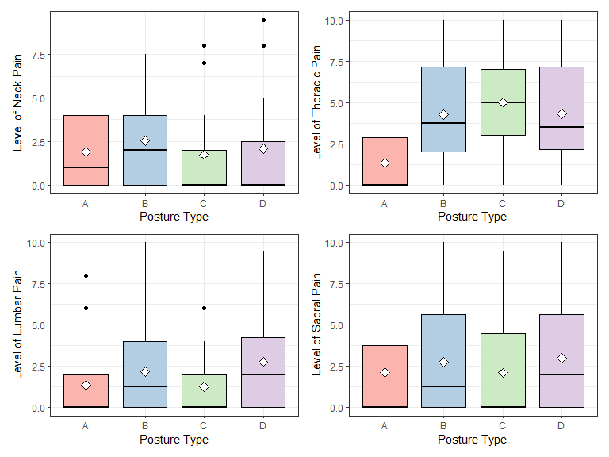

# 4 Model Setup

## 4.1 Data Split & *k*-Fold Cross Validation

We now split our data into training and testing sets! Here, we use a
75/25 training to testing ratio and stratify according to our outcome
variable. For this model, we will be using 10-fold cross-validation
(stratified according to the outcome variable) to estimate our testing
error:

``` r
person_split <- initial_split(data = data1, prop = 0.75, strata = e_i)  # initial split

person_train <- training(person_split)  # training set
person_test <- testing(person_split)  # testing set

person_folds <- vfold_cv(data = person_train, v = 10, strata = e_i)  # 10-fold cross validation
```

## 4.2 Recipe Building

We will use the ‘recipes’ package to aid in pre-processing. We will
create three separate recipes (all with the same outcome variable) with
differing pre-processing steps. The first recipe `simple_rec` will be,
as the name implies, very simple. We will only specify that this recipe
will have an outcome variable `e_i` and use all the predictors in the
training set we created above.

``` r
simple_rec <- recipe(e_i ~ ., data = person_train)
```

Our second recipe `corr_rec` will use the same outcome and predictors as
our first recipe. However, we will also apply a correlation filter which
will potentially remove variables that have large absolute correlations
with other variables. The threshold for correlation filter will be
tuned. In addition, we will dummy-code all nominal/categorical
predictors and normalize all numeric predictors.

``` r
corr_rec <- simple_rec %>%
    step_corr(all_numeric_predictors(), threshold = tune()) %>%
    step_dummy(all_nominal_predictors()) %>%
    step_normalize(all_numeric_predictors())
```

The third recipe `pca_rec` will have the same outcome and predictors as
the other two recipes. This recipe will also dummy-code all nominal
predictors. We also apply a Yeo-Johnson transformation to all numeric
predictors and normalize these predictors as well. Finally, we apply
Principal Components Analysis (PCA) as a pre-processing step which will
convert our data into a tunable amount of principal components.

``` r
pca_rec <- simple_rec %>%
    step_dummy(all_nominal_predictors()) %>%
    step_YeoJohnson(all_numeric_predictors()) %>%
    step_normalize(all_numeric_predictors()) %>%
    step_pca(all_numeric_predictors(), num_comp = tune())
```

## 4.3 Model Specifications

Now we specify the models we will use. Note that not every model
specification will be used with every recipe. Some models require
specific pre-processing steps while other models are more lenient; e.g.,
a random forest does not require normalization and dummy-coding but
(depending on implementation) requires imputing missing values.

Overall, we will specify a random forest model, K-nearest neighbors
model, elastic-net logistic regression model, and linear support vector
machine model. These model specifications will be set using the
‘parsnip’ package. Note that we are working on a binary classification
problem, thus we set the mode, using `set_mode()`, to “classification”
for all our model specifications. Each specification will also include
an engine and any tunable hyper-parameters:

### 4.3.1 Random Forest

Here we specify a random forest model using the ‘ranger’ engine. For
this specification, we will tune `mtry` (the number of randomly selected
predictors), `trees` (the number of trees), and `min_n` (the minimal
node size). We also set importance to the ‘impurity’ measure which is
the [Gini
index](https://en.wikipedia.org/wiki/Decision_tree_learning#Gini_impurity).

``` r
forest_spec <- rand_forest(mtry = tune(), min_n = tune(), trees = tune()) %>%
    set_mode("classification") %>%
    set_engine("ranger", importance = "impurity")
```

### 4.3.2 K-Nearest Neighbors

Here we specify a K-nearest neighbors model using the ‘kknn’ engine. For
this specification, we will tune the number of nearest neighbors
`negihbors`.

``` r
knn_spec <- nearest_neighbor(neighbors = tune()) %>%
    set_mode("classification") %>%
    set_engine("kknn")
```

### 4.3.3 Elastic-Net Logistic Regression

Here we specify an elastic-net logistic regression model using the
‘glmnet’ engine. For this specification, we will tune the amount of
regularization `penalty` and the proportion of Lasso penalty `mixture`.

``` r
log_spec <- logistic_reg(penalty = tune(), mixture = tune()) %>%
    set_mode("classification") %>%
    set_engine("glmnet")
```

### 4.3.4 Linear Support Vector Machines

Here we specify a linear support verctor machine via the ‘kernlab’
engine. For this specification, we tune the cost hyper-parameter `cost`.

``` r
svm_spec <- svm_linear(cost = tune()) %>%
    set_mode("classification") %>%
    set_engine("kernlab")
```

# 5 Model Tuning & Evaluation

## 5.1 Workflow Sets

We specify a workflow set for each of the three recipes. Each workflow
set contains a pre-processor (the recipe) and the models to be used with
that pre-processor. Recall that not every model specification will be
used with each recipe. Provided is a table to aid in interpreting which
models will be used with each recipe:

<center>

| Workflow Set |    Recipe    |              Model              |
|:------------:|:------------:|:-------------------------------:|
| `simple_wf`  | `simple_rec` |          Random Forest          |
|  `corr_wf`   |  `corr_rec`  |       K-Nearest Neighbors       |
|  `corr_wf`   |  `corr_rec`  | Elastic-Net Logistic Regression |
|   `pca_wf`   |  `pca_rec`   | Elastic-Net Logistic Regression |
|   `pca_wf`   |  `pca_rec`   |  Linear Support Vector Macine   |

</center>

``` r
simple_wf <- workflow_set(
    preproc = list(simple = simple_rec),
    models = list(random_forest = forest_spec)
)

corr_wf <- workflow_set(
    preproc = list(corr = corr_rec),
    models = list(knn = knn_spec, log_reg = log_spec)
)

pca_wf <- workflow_set(
    preproc = list(pca = pca_rec),
    models = list(log_reg = log_spec, svm = svm_spec)
)
```

## 5.2 Workflow Map & Tuning

Now we create a workflow map to tune any hyper-parameters in our models.
Before that, we first bind all the workflow sets created above. This
creates a new workflow set which contains all our previous sets. We also
specific a control grid to set any arguments for tuning. In this case,
we set arguments that will save our predictions, save our workflow, and
allow tuning to be performed in parallel at two levels (an outer
parallel loop will iterate over resamples, and an inner parallel loop
will iterate over all unique combinations of pre-processor and model
tuning parameters for that specific resample).

Finally, we create a workflow map `grid_results` which contains our
binded workflow sets, a seed, our resamples/folds, a grid value, and the
control grid we just created. We set our grid value to $10$, which means
that grid search is applied to each workflow using up to $10$ different
parameter candidates.

> NOTE: The following chunk was set to *not* evaluate. Instead, the
> tuning results were saved in a .rds file. This was done to save
> computation power and time.

``` r
all_workflows <- bind_rows(simple_wf, corr_wf, pca_wf)

grid_ctrl <- control_grid(save_pred = TRUE, parallel_over = "everything", save_workflow = TRUE)

grid_results <- all_workflows %>%
    workflow_map(seed = 123, resamples = person_folds, grid = 10, control = grid_ctrl)

grid_results %>%
    write_rds("predicting_personality_files/Models/tuned_grid.rds")
```

## 5.3 Evaluation of Models

Let’s read in our results from our .rds file! We generate a plot which
ranks each model and pre-processor combination according to the
(estimated) area under the ROC (receiver operator characteristic) curve.
Approximate confidence intervals are also shown. We also generate a
table which shows similar results:

``` r
grid_results <- read_rds(file = "predicting_personality_files/Models/tuned_grid.rds")

autoplot(grid_results, rank_metric = "roc_auc", metric = "roc_auc", select_best = TRUE) +
    geom_text(
        aes(y = mean - 0.5, label = wflow_id),
        angle = 90, hjust = 0.2
    ) +
    ylim(0, 0.8) +
    theme(legend.position = "none")
```

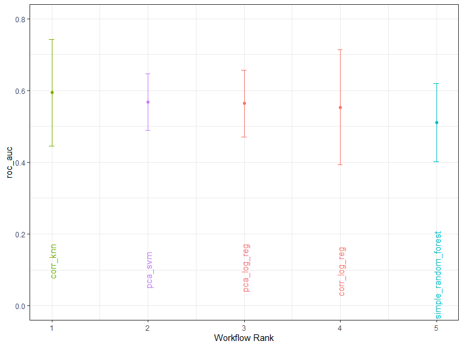

``` r
grid_results %>%
    rank_results(select_best = TRUE) %>%
    filter(.metric == "roc_auc") %>%
    select(wflow_id, .config, roc_auc = mean, rank)
```

<div class="kable-table">

| wflow_id             | .config               |   roc_auc | rank |
|:---------------------|:----------------------|----------:|-----:|
| corr_knn             | Preprocessor08_Model1 | 0.5937500 |    1 |
| pca_svm              | Preprocessor1_Model2  | 0.5680556 |    2 |
| pca_log_reg          | Preprocessor2_Model2  | 0.5638889 |    3 |
| corr_log_reg         | Preprocessor02_Model1 | 0.5527778 |    4 |
| simple_random_forest | Preprocessor1_Model05 | 0.5111111 |    5 |

</div>

Notice that the K-Nearest Neighbors model using the `corr_rec` recipe
did the best in terms of estimated area under the ROC curve value of
about 0.5937.

Recall that the threshold of the correlation filter in `corr_recipe` was
tunable. Additionally, the number of neighbors in the KNN model was
tuneable. We generate a plot to see what values of these
hyper-parameters work best for our model according to the area under the
ROC curve. We then extract the best parameters values from the workflow
set:

``` r
autoplot(grid_results, id = "corr_knn", metric = "roc_auc")
```

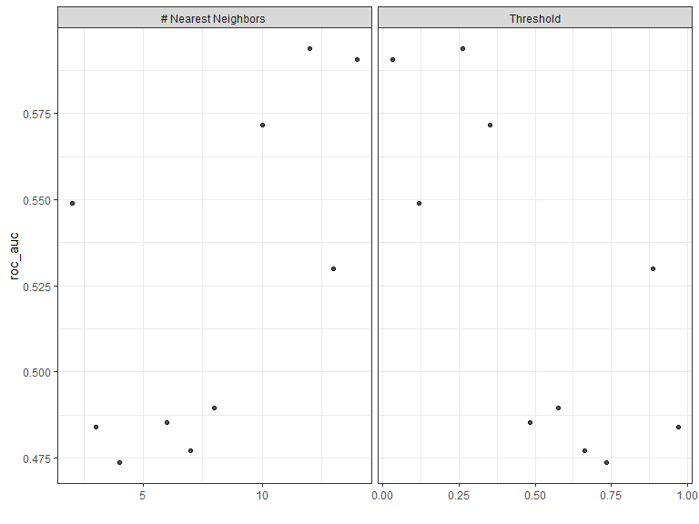

``` r
best_knn <- grid_results %>%
    extract_workflow_set_result(id = "corr_knn") %>%
    select_by_one_std_err(metric = "roc_auc", -neighbors)
best_knn
```

<div class="kable-table">

| neighbors | threshold | .metric | .estimator |     mean |   n |  std_err | .config               |   .best |    .bound |
|----------:|----------:|:--------|:-----------|---------:|----:|---------:|:----------------------|--------:|----------:|
|        14 | 0.0328867 | roc_auc | binary     | 0.590625 |  10 | 0.098895 | Preprocessor02_Model1 | 0.59375 | 0.5035658 |

</div>

``` r
knn_results <- grid_results %>%
    extract_workflow_set_result(id = "corr_knn")
```

According to the plots above, we see that higher number of neighbors and
lower threshold values for the correlation filter lead to better results
according the the area under the ROC curve. The table shows that $14$
neighbors with a correlation filter threshold of about $0.0329$ leads to
a ROC_AUC value of about $0.5906$.

Let’s create a confusion matrix heatmap to aid in evaluating our model
on our folds:

``` r
knn_results %>%
    collect_predictions() %>%
    inner_join(best_knn) %>%
    conf_mat(truth = e_i, estimate = .pred_class) %>%
    autoplot(type = "heatmap") +
    scale_fill_distiller()
```

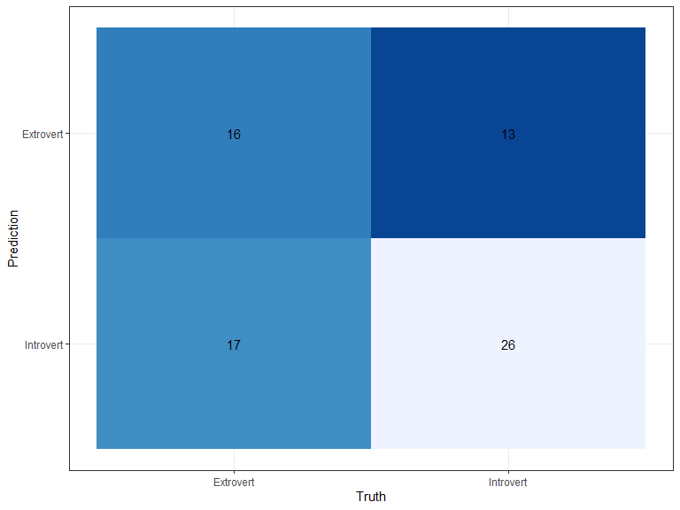

We see that there were $16$ extroverts that were correctly identified
but $17$ extroverts that were misidentified as introverts. Additionally,
$26$ introverts were correctly identified but $13$ introverts were
misidentified as extroverts. Our true positive rate is about $0.4848485$
and our false positive rate is about $0.3333333$. For comparison, the
“perfect” classifier would have a true positive value of $1$ and a false
positive value of $0$.

Furthermore, we generate an ROC curve with a point where $x$ is the
false positive rate and $y$ is the true positive rate:

``` r
knn_results %>%
    collect_predictions() %>%
    inner_join(best_knn) %>%
    roc_curve(truth = e_i, estimate = .pred_Extrovert) %>%
    autoplot() + geom_point(
    aes(x = 13/(13 + 26), y = 16/(16 + 17)),
    colour = "red", size = 2.5
)
```

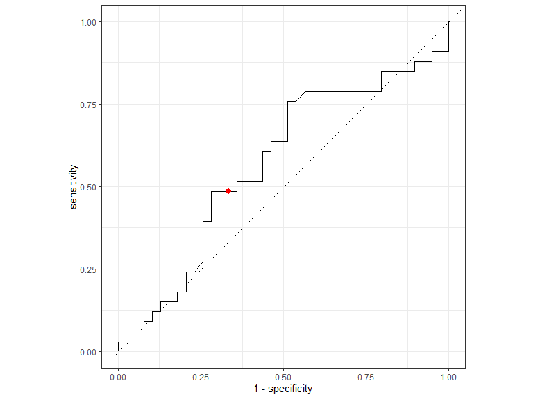

Ideally, we would want the ROC curve to hit the upper-left corner.
Which, again, would mean a high true positive (sensitivity) value and a
low false positive ($1-\text{specificity}$) value. Our ROC curve is not
very close to this ideal area. On our folds, it seems that our
classifier predicts if a participant is an extrovert or introvert
according to a (slightly biased) coin flip.

We can also plot the distribution of our predictions:

``` r
knn_results %>%
    collect_predictions() %>%
    inner_join(best_knn) %>%
    ggplot(aes(x = .pred_Extrovert, fill = e_i)) +
    geom_boxplot() + xlab("Probability of Extrovert") +
    scale_fill_brewer(palette = "Pastel1") +
    labs(fill = NULL)
```

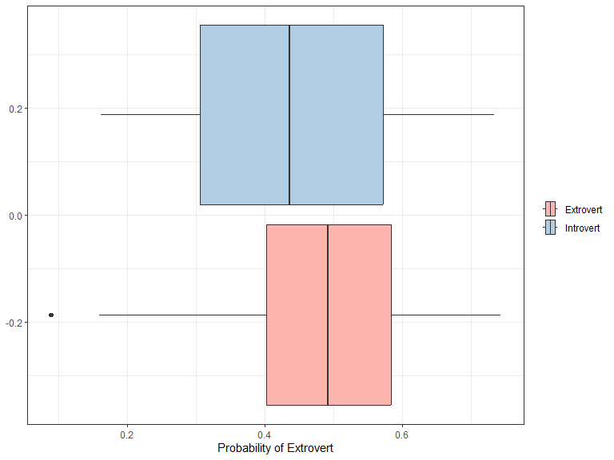

Notice that there is a fair amount of overlap between our predictions
between extroverts and introverts. This reiterates the fact that our
model predicts between a participant being and extrovert or introvert
according to a coin flip, on the folds.

# 6 Final Evaluation & Concluding Remarks

## 6.1 Model Evaluation on Testing Data

Lastly, we finalize our workflow for our KNN model and fit our model to
the training and testing sets using `last_fit()`:

``` r
final_wf <- grid_results %>%
    extract_workflow(id = "corr_knn") %>%
    finalize_workflow(best_knn)

final_fit <- last_fit(final_wf, person_split)
```

We can now evaluate how well our model does on new (unobserved) data:

``` r
final_fit %>%
    collect_metrics() %>%
    filter(.metric == "roc_auc")
```

<div class="kable-table">

| .metric | .estimator | .estimate | .config              |
|:--------|:-----------|----------:|:---------------------|
| roc_auc | binary     | 0.5544872 | Preprocessor1_Model1 |

</div>

Fitting to our testing data, our model resulted in an area under the ROC
curve value of about $0.5545$. This suggests that the classifier is not
able to discriminate against introverts and extroverts. For comparison,
the “perfect” classifier would have an area under the ROC curve value of
$1$.

Let’s continue to more closely evaluate our model. First, we generate a
confusion matrix heatmap:

``` r
final_fit %>%
    collect_predictions() %>%
    conf_mat(truth = e_i, estimate = .pred_class) %>%
    autoplot(type = "heatmap") +
    scale_fill_distiller()
```

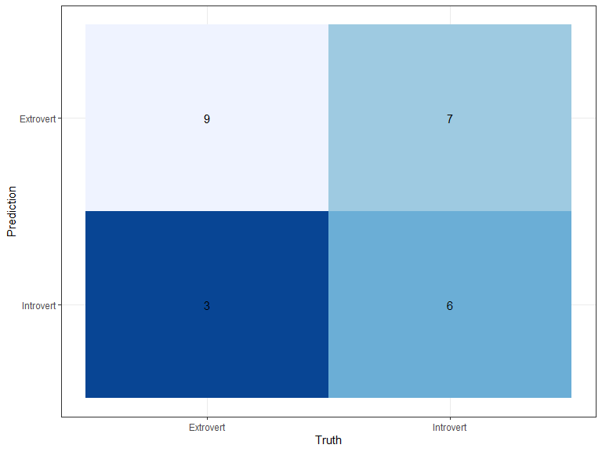

According to the confusion matrix, we have a true positive rate
(probability of a subject being classified as an extrovert, when in fact
they are in extrovert) of about $0.75$ and a false positive rate
(probability of a subject being classified as an extrovert, when in fact
they are in introvert) of about $0.5384615$. It seems that the model is
better at classifying extroverts than introverts.

We can also generate an ROC curve:

``` r
final_fit %>%
    collect_predictions() %>%
    roc_curve(truth = e_i, estimate = .pred_Extrovert) %>%
    autoplot() + geom_point(
    aes(x = 7/(7 + 6), y = 9/(9 + 3)),
    colour = "red", size = 2.5
)
```

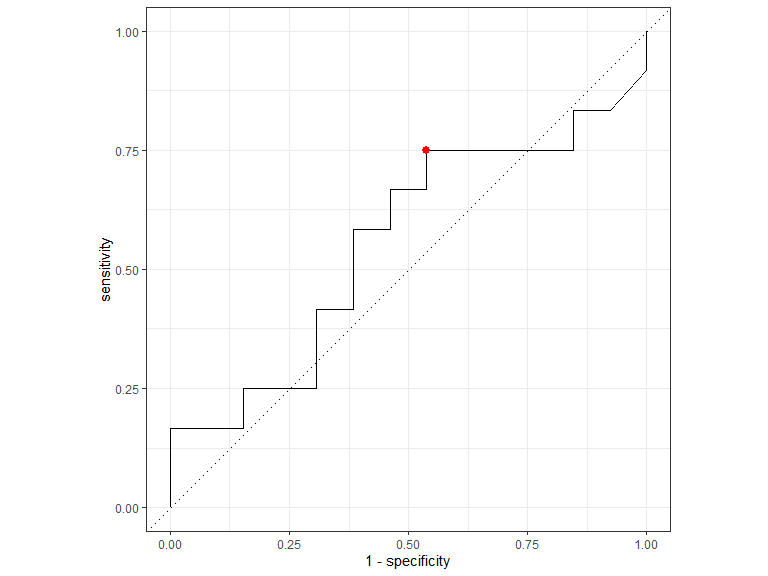

Recall that the ROC curve for the “perfect” classifier would hit the
upper left corner of the plot. Notice that our curve is not very close
to the upper right corner. This supports the area under the ROC curve
value we computed above.

## 6.2 Concluding Remarks

All in all, our classification model did not perform as well as I wanted
it to. Although somewhat disappointing, this was a great learning
experience.

This model may have done poorly due to the low number of observations.
The more observations the better, but in this case the data set only
contained about $100$ observations. Even if we were to try other model
specifications, the size of the data set would have impacted the model
negatively.

We could have also used some unsupervised learning methods to explore
relationships between the personality types, posture types, and other
features. Once again, a larger data set would definitely help in
pursuing this.

It could also be the case that it is just not possible to classify
people as extroverts and introverts based on the features used.
Personality data is very intricate and difficult to work with, hence
leading us to unfavorable results with this model.

# 7 References

<div id="refs" class="references csl-bib-body hanging-indent">

<div id="ref-guimond2012" class="csl-entry">

Guimond, Sylvain, and Wael Massrieh. 2012. “Intricate Correlation
Between Body Posture, Personality Trait and Incidence of Body Pain: A
Cross-Referential Study Report.” Edited by Marianna Mazza. *PLoS ONE* 7
(5): e37450. <https://doi.org/10.1371/journal.pone.0037450>.

</div>

</div>
