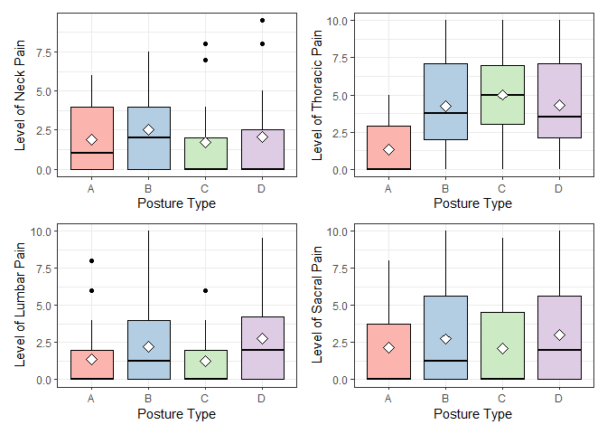
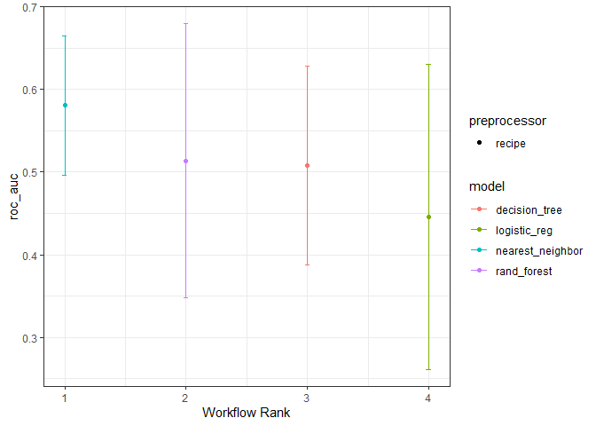
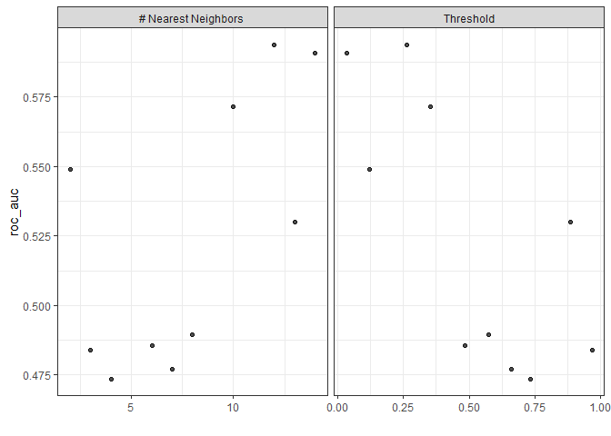
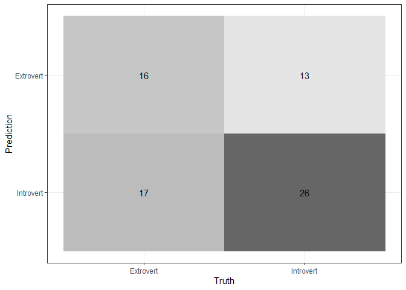
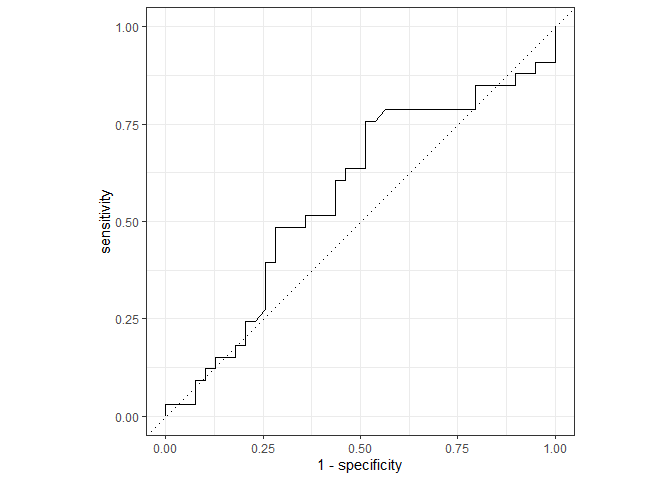
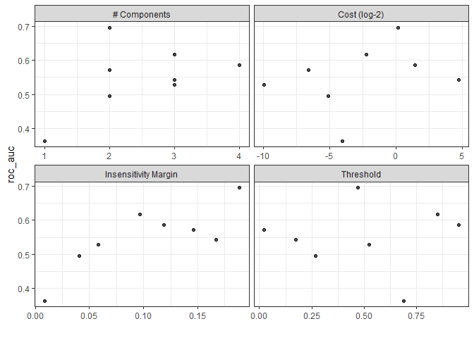
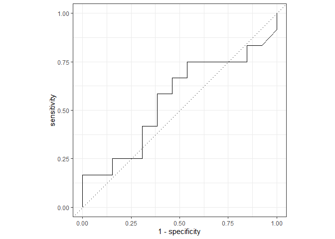

Posture Project
================
Giovani Gutierrez
2023-02-15

- <a href="#1-getting-started" id="toc-1-getting-started">1 Getting
  Started</a>
  - <a href="#11-setup" id="toc-11-setup">1.1 Setup</a>
  - <a href="#12-import-data" id="toc-12-import-data">1.2 Import Data</a>
  - <a href="#13-tidy-data--missing-values"
    id="toc-13-tidy-data--missing-values">1.3 Tidy Data &amp; Missing
    Values</a>
- <a href="#2-exploratory-data-analysis-eda"
  id="toc-2-exploratory-data-analysis-eda">2 Exploratory Data Analysis
  (EDA)</a>
  - <a href="#21-correlation-between-features"
    id="toc-21-correlation-between-features">2.1 Correlation Between
    Features</a>
  - <a href="#22-visual-eda" id="toc-22-visual-eda">2.2 Visual EDA</a>
- <a href="#3-model-setup" id="toc-3-model-setup">3 Model Setup</a>
  - <a href="#31-data-split--k-fold-cross-validation"
    id="toc-31-data-split--k-fold-cross-validation">3.1 Data Split &amp;
    <em>k</em>-Fold Cross Validation</a>
  - <a href="#32-recipe-building--workflow"
    id="toc-32-recipe-building--workflow">3.2 Recipe Building &amp;
    Workflow</a>
  - <a href="#33-model-specifications" id="toc-33-model-specifications">3.3
    Model Specifications</a>
    - <a href="#331-first-recipe-simple_rec"
      id="toc-331-first-recipe-simple_rec">3.3.1 First Recipe
      (<code>simple_rec</code>)</a>
    - <a href="#332-second-recipe-corr_rec"
      id="toc-332-second-recipe-corr_rec">3.3.2 Second Recipe
      (<code>corr_rec</code>)</a>
    - <a href="#333-third-recipe-pca_rec"
      id="toc-333-third-recipe-pca_rec">3.3.3 Third Recipe
      (<code>pca_rec</code>)</a>
- <a href="#4-model-tuning--evaluation"
  id="toc-4-model-tuning--evaluation">4 Model Tuning &amp; Evaluation</a>
  - <a href="#41-workflow-sets" id="toc-41-workflow-sets">4.1 Workflow
    Sets</a>
  - <a href="#42-workflow-map--tuning" id="toc-42-workflow-map--tuning">4.2
    Workflow Map &amp; Tuning</a>
  - <a href="#43-evaluation-of-models" id="toc-43-evaluation-of-models">4.3
    Evaluation of Models</a>

# 1 Getting Started

## 1.1 Setup

``` r
library(tidyverse)
library(tidymodels)
library(readxl)
library(janitor)
library(visdat)
library(naniar)
library(corrplot)
library(patchwork)
library(glmnet)
library(kknn)
library(ranger)
library(vip)
library(kernlab)
library(GGally)
tidymodels_prefer()
theme_set(theme_bw())

set.seed(123)  # set seed
```

## 1.2 Import Data

``` r
data1 <- read_xls("C:/Users/giova/Desktop/PSTAT 131/predicting_personality/Data/Posture_Data.xls") %>%
    clean_names()  # read in raw data from .xls file

data1 %>%
    write.csv(file = "C:/Users/giova/Desktop/PSTAT 131/predicting_personality/Data/raw_data.csv")  # write raw data to .csv file

head(data1)  # preview data
```

    ## # A tibble: 6 × 66
    ##   number_1   age height weight sex    activi…¹ pain_1 pain_2 pain_3 pain_4 mbti 
    ##   <chr>    <dbl>  <dbl>  <dbl> <chr>  <chr>    <chr>  <chr>  <chr>  <chr>  <chr>
    ## 1 1           53     62    125 Female Low      0      0      0      0      ESFJ 
    ## 2 3           30     69    200 Male   High     0      0      0      0      ESTJ 
    ## 3 5           45     63    199 Female Moderate 4      5      2      2      ENFJ 
    ## 4 15          30     69    190 Male   Moderate 0      0      4      7      ESTP 
    ## 5 17          59     66    138 Female Low      6      3      6      6      ESTJ 
    ## 6 27          36     68    165 Male   High     0      2      0      0      ESTP 
    ## # … with 55 more variables: e <chr>, i <chr>, s <chr>, n <chr>, t <chr>,
    ## #   f <chr>, j <chr>, p <chr>, posture <chr>, number_21 <chr>, l1 <chr>,
    ## #   l2_d <chr>, l3 <chr>, l4_d <dbl>, l5 <chr>, l6_d <dbl>, l7 <chr>,
    ## #   l8_d <dbl>, l9 <chr>, l10_d <chr>, l11 <chr>, l12_i <dbl>, l13 <chr>,
    ## #   l14_i <chr>, l15 <chr>, l16_i <dbl>, l17 <chr>, l18_i <dbl>, l19 <chr>,
    ## #   l20_i <dbl>, l21 <chr>, l22_i <dbl>, l23 <chr>, l24_i <chr>, l25_i <dbl>,
    ## #   l26 <dbl>, l27 <dbl>, l28 <dbl>, l29 <chr>, l30 <chr>, l31 <dbl>, …

## 1.3 Tidy Data & Missing Values

``` r
data1 <- data1 %>%
    replace_with_na_all(condition = ~.x == "X")  # replace 'X' character values with NA values

data1 %>%
    vis_miss()  # visualize missing values
```


``` r
data1 <- data1 %>%
    select(age:posture & -mbti) %>%
    drop_na()  # drop missing and irrelevant variables

data1 <- data1 %>%
    mutate(sex = factor(sex)) %>%
    mutate(activity_level = ordered(activity_level, levels = c("Low", "Moderate",
        "High"))) %>%
    mutate_at(c("pain_1", "pain_2", "pain_3", "pain_4"), as.numeric) %>%
    mutate(e_i = factor(ifelse(e > i, "Extrovert", "Introvert"))) %>%
    mutate_at(c("s", "n", "t", "f", "j", "p"), as.numeric) %>%
    mutate(posture = factor(posture)) %>%
    select(-e & -i)  # coerce variables into appropriate type

data1 %>%
    vis_dat()  # visualize variable types
```


``` r
data1 %>%
    write.csv(file = "C:/Users/giova/Desktop/PSTAT 131/predicting_personality/Data/clean_data.csv")  # write clean data to .csv file

head(data1)  # preview cleaned data
```

    ## # A tibble: 6 × 17
    ##     age height weight sex    activity_…¹ pain_1 pain_2 pain_3 pain_4     s     n
    ##   <dbl>  <dbl>  <dbl> <fct>  <ord>        <dbl>  <dbl>  <dbl>  <dbl> <dbl> <dbl>
    ## 1    53     62    125 Female Low              0      0      0      0    17     9
    ## 2    30     69    200 Male   High             0      0      0      0    16    10
    ## 3    45     63    199 Female Moderate         4      5      2      2    20     6
    ## 4    30     69    190 Male   Moderate         0      0      4      7    22     4
    ## 5    59     66    138 Female Low              6      3      6      6    18     8
    ## 6    36     68    165 Male   High             0      2      0      0    20     6
    ## # … with 6 more variables: t <dbl>, f <dbl>, j <dbl>, p <dbl>, posture <fct>,
    ## #   e_i <fct>, and abbreviated variable name ¹​activity_level

- `age`: Age of participant (in years)
- `height`: Height of participant (in inches)
- `weight`: Weight of participant (in pounds)
- `sex`: Sex of the participant (male or female)
- `activity_level`: Amount of daily physical activity performed by a
  participant (low, moderate, or high)
- `pain_1`: Pain in the neck reported on a scale from 0 (low) to 10
  (high) by a participant
- `pain_2`: Pain in the thoracic reported on a scale from 0 (low) to 10
  (high) by a participant
- `pain_3`: Pain in the lumbar reported on a scale from 0 (low) to 10
  (high) by the participant
- `pain_4`: Pain in the sacrum reported on a scale from 0 (low) to 10
  (high) by the participant
- `s`: A participant’s sensing characteristic on a scale from 1 (low) to
  26 (high)
- `i`: A participant’s intuition characteristic on a scale from 1 (low)
  to 26 (high)
- `t`: A participant’s thinking characteristic on a scale from 1 (low)
  to 26 (high)
- `f`: A participant’s feeling characteristic on a scale from 1 (low) to
  26 (high)
- `j`: A participant’s judging characteristic on a scale from 1 (low) to
  26 (high)
- `p`: A participant’s perceiving characteristic on a scale from 1 (low)
  to 26 (high)
- `posture`: Type of posture exhibited by a participant (ideal posture
  (A), kyphosis-lordosis (B), flat-back (C), and sway-back (D))
- `e_i`: Categorization of participant as an extrovert or introvert;
  based on whichever score was higher on their MBTI questionnaire

# 2 Exploratory Data Analysis (EDA)

## 2.1 Correlation Between Features

``` r
tmwr_cols <- colorRampPalette(c("#CA225E", "#91CBD765"))

data1 %>%
    select_if(is.numeric) %>%
    cor() %>%
    corrplot(col = tmwr_cols(200), tl.col = "black", method = "circle", type = "lower",
        diag = FALSE)
```


## 2.2 Visual EDA

``` r
data1 %>%
    select(e_i, age, height, weight) %>%
    ggpairs(mapping = aes(color = e_i)) + scale_fill_brewer(palette = "Pastel1")
```


``` r
data1 %>%
    select(e_i, pain_1, pain_2, pain_3, pain_4) %>%
    ggpairs(mapping = aes(color = e_i)) + scale_fill_brewer(palette = "Pastel1")
```


``` r
data1 %>%
    select(e_i, posture) %>%
    ggpairs(mapping = aes(color = e_i)) + scale_fill_brewer(palette = "Pastel1")
```


``` r
data1 %>%
    select(e_i, s, n, t, f, j, p) %>%
    ggpairs(mapping = aes(color = e_i)) + scale_fill_brewer(palette = "Pastel1")
```


``` r
p1 <- ggplot(data = data1, aes(x = posture, y = pain_1, fill = posture)) + geom_boxplot(color = "black") +
    stat_summary(fun.y = "mean", geom = "point", shape = 23, size = 3, fill = "white") +
    scale_fill_brewer(palette = "Pastel1") + labs(x = "Posture Type", y = "Level of Neck Pain") +
    guides(fill = FALSE)

p2 <- ggplot(data = data1, aes(x = posture, y = pain_2, fill = posture)) + geom_boxplot(color = "black") +
    stat_summary(fun.y = "mean", geom = "point", shape = 23, size = 3, fill = "white") +
    scale_fill_brewer(palette = "Pastel1") + labs(x = "Posture Type", y = "Level of Thoracic Pain") +
    guides(fill = FALSE)

p3 <- ggplot(data = data1, aes(x = posture, y = pain_3, fill = posture)) + geom_boxplot(color = "black") +
    stat_summary(fun.y = "mean", geom = "point", shape = 23, size = 3, fill = "white") +
    scale_fill_brewer(palette = "Pastel1") + labs(x = "Posture Type", y = "Level of Lumbar Pain") +
    guides(fill = FALSE)

p4 <- ggplot(data = data1, aes(x = posture, y = pain_4, fill = posture)) + geom_boxplot(color = "black") +
    stat_summary(fun.y = "mean", geom = "point", shape = 23, size = 3, fill = "white") +
    scale_fill_brewer(palette = "Pastel1") + labs(x = "Posture Type", y = "Level of Sacral Pain") +
    guides(fill = FALSE)

p1 + p2 + p3 + p4
```



# 3 Model Setup

## 3.1 Data Split & *k*-Fold Cross Validation

``` r
person_split <- initial_split(data = data1, prop = 0.75, strata = e_i)  # initial split

person_train <- training(person_split)  # training set
person_test <- testing(person_split)  # testing set

person_folds <- vfold_cv(data = person_train, v = 10, strata = e_i)  # 10-fold cross validation
```

## 3.2 Recipe Building & Workflow

``` r
simple_rec <- recipe(e_i ~ ., data = person_train)

corr_rec <- simple_rec %>%
    step_corr(all_numeric_predictors(), threshold = tune()) %>%
    step_dummy(all_nominal_predictors()) %>%
    step_normalize(all_numeric_predictors())

pca_rec <- simple_rec %>%
    step_dummy(all_nominal_predictors()) %>%
    step_YeoJohnson(all_numeric_predictors()) %>%
    step_normalize(all_numeric_predictors()) %>%
    step_pca(all_numeric_predictors(), num_comp = tune())
```

## 3.3 Model Specifications

### 3.3.1 First Recipe (`simple_rec`)

#### 3.3.1.1 Random Forest

``` r
forest_spec <- rand_forest(mtry = tune(), min_n = tune(), trees = tune()) %>%
    set_mode("classification") %>%
    set_engine("ranger", importance = "impurity")
```

### 3.3.2 Second Recipe (`corr_rec`)

#### 3.3.2.1 K-Nearest Neighbors

``` r
knn_spec <- nearest_neighbor(neighbors = tune()) %>%
    set_mode("classification") %>%
    set_engine("kknn")
```

#### 3.3.2.2 Logistic Regression

``` r
log_spec <- logistic_reg(penalty = tune(), mixture = tune()) %>%
    set_mode("classification") %>%
    set_engine("glmnet")
```

### 3.3.3 Third Recipe (`pca_rec`)

#### 3.3.3.1 Support Vector Machine

``` r
svm_spec <- svm_linear(cost = tune()) %>%
    set_mode("classification") %>%
    set_engine("kernlab")
```

# 4 Model Tuning & Evaluation

## 4.1 Workflow Sets

``` r
simple_wf <- workflow_set(preproc = list(simple = simple_rec), models = list(random_forest = forest_spec))

corr_wf <- workflow_set(preproc = list(corr = corr_rec), models = list(knn = knn_spec,
    log_reg = log_spec))

pca_wf <- workflow_set(preproc = list(pca = pca_rec), models = list(log_reg = log_spec,
    svm = svm_spec))
```

## 4.2 Workflow Map & Tuning

``` r
all_workflows <- bind_rows(simple_wf, corr_wf, pca_wf)

grid_ctrl <- control_grid(save_pred = TRUE, parallel_over = "everything", save_workflow = TRUE)

grid_results <- all_workflows %>%
    workflow_map(seed = 123, resamples = person_folds, grid = 10, control = grid_ctrl)

grid_results %>%
    write_rds("C:/Users/giova/Desktop/PSTAT 131/predicting_personality/predicting_personality_files/Models/tuned_grid.rds")
```

## 4.3 Evaluation of Models

``` r
grid_results <- read_rds(file = "C:/Users/giova/Desktop/PSTAT 131/predicting_personality/predicting_personality_files/Models/tuned_grid.rds")

autoplot(grid_results, rank_metric = "roc_auc", metric = "roc_auc", select_best = TRUE) +
    geom_text(aes(y = mean - 0.5, label = wflow_id), angle = 90, hjust = 0.2) + ylim(0,
    0.8) + theme(legend.position = "none")
```



``` r
grid_results %>%
    rank_results(select_best = TRUE) %>%
    filter(.metric == "roc_auc") %>%
    select(wflow_id, .config, roc_auc = mean, rank)
```

    ## # A tibble: 5 × 4
    ##   wflow_id             .config               roc_auc  rank
    ##   <chr>                <chr>                   <dbl> <int>
    ## 1 corr_knn             Preprocessor08_Model1   0.594     1
    ## 2 pca_svm              Preprocessor1_Model2    0.568     2
    ## 3 pca_log_reg          Preprocessor2_Model2    0.564     3
    ## 4 corr_log_reg         Preprocessor02_Model1   0.553     4
    ## 5 simple_random_forest Preprocessor1_Model05   0.511     5

``` r
autoplot(grid_results, id = "corr_knn", metric = "roc_auc")
```



``` r
best_knn <- grid_results %>%
    extract_workflow_set_result(id = "corr_knn") %>%
    select_by_one_std_err(metric = "roc_auc", -neighbors)

knn_results <- grid_results %>%
    extract_workflow_set_result(id = "corr_knn")

knn_results %>%
    collect_predictions() %>%
    inner_join(best_knn) %>%
    conf_mat(truth = e_i, estimate = .pred_class) %>%
    autoplot(type = "heatmap")
```



``` r
knn_results %>%
    collect_predictions() %>%
    inner_join(best_knn) %>%
    roc_curve(truth = e_i, estimate = .pred_Extrovert) %>%
    autoplot()
```



``` r
final_wf <- grid_results %>%
    extract_workflow(id = "corr_knn") %>%
    finalize_workflow(best_knn)

final_fit <- last_fit(final_wf, person_split)

final_fit %>%
    collect_metrics()
```

    ## # A tibble: 2 × 4
    ##   .metric  .estimator .estimate .config             
    ##   <chr>    <chr>          <dbl> <chr>               
    ## 1 accuracy binary         0.6   Preprocessor1_Model1
    ## 2 roc_auc  binary         0.554 Preprocessor1_Model1

``` r
final_fit %>%
    collect_predictions() %>%
    conf_mat(truth = e_i, estimate = .pred_class) %>%
    autoplot(type = "heatmap")
```



``` r
final_fit %>%
    collect_predictions() %>%
    roc_curve(truth = e_i, estimate = .pred_Extrovert) %>%
    autoplot()
```


