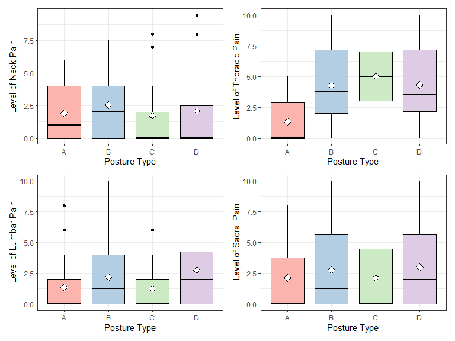
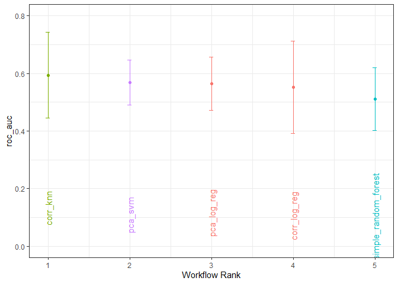
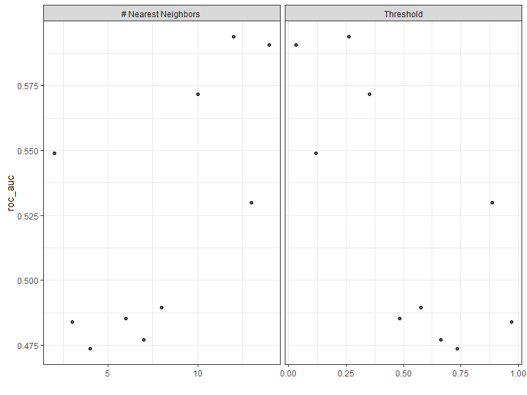
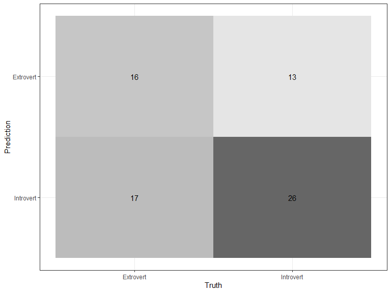
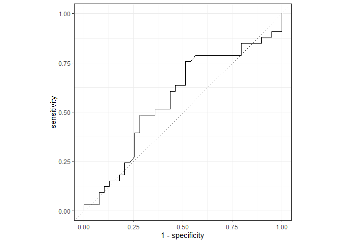
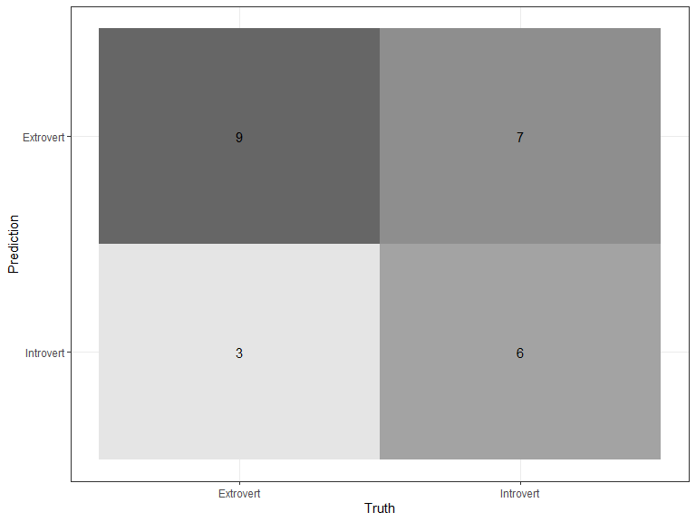
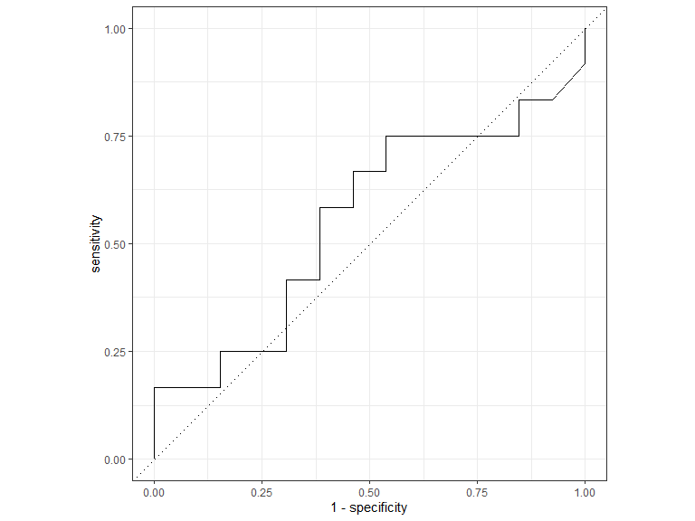

Posture Project
================
Giovani Gutierrez
2023-03-13

- <a href="#1-getting-started" id="toc-1-getting-started">1 Getting
  Started</a>
  - <a href="#11-setup" id="toc-11-setup">1.1 Setup</a>
  - <a href="#12-import-data" id="toc-12-import-data">1.2 Import Data</a>
  - <a href="#13-tidy-data--missing-values"
    id="toc-13-tidy-data--missing-values">1.3 Tidy Data &amp; Missing
    Values</a>
- <a href="#2-exploratory-data-analysis-eda"
  id="toc-2-exploratory-data-analysis-eda">2 Exploratory Data Analysis
  (EDA)</a>
  - <a href="#21-codebook" id="toc-21-codebook">2.1 Codebook</a>
  - <a href="#22-correlation-between-features"
    id="toc-22-correlation-between-features">2.2 Correlation Between
    Features</a>
  - <a href="#23-visual-eda" id="toc-23-visual-eda">2.3 Visual EDA</a>
- <a href="#3-model-setup" id="toc-3-model-setup">3 Model Setup</a>
  - <a href="#31-data-split--k-fold-cross-validation"
    id="toc-31-data-split--k-fold-cross-validation">3.1 Data Split &amp;
    <em>k</em>-Fold Cross Validation</a>
  - <a href="#32-recipe-building--workflow"
    id="toc-32-recipe-building--workflow">3.2 Recipe Building &amp;
    Workflow</a>
  - <a href="#33-model-specifications" id="toc-33-model-specifications">3.3
    Model Specifications</a>
    - <a href="#331-first-recipe-simple_rec"
      id="toc-331-first-recipe-simple_rec">3.3.1 First Recipe
      (<code>simple_rec</code>)</a>
    - <a href="#332-second-recipe-corr_rec"
      id="toc-332-second-recipe-corr_rec">3.3.2 Second Recipe
      (<code>corr_rec</code>)</a>
    - <a href="#333-third-recipe-pca_rec"
      id="toc-333-third-recipe-pca_rec">3.3.3 Third Recipe
      (<code>pca_rec</code>)</a>
- <a href="#4-model-tuning--evaluation"
  id="toc-4-model-tuning--evaluation">4 Model Tuning &amp; Evaluation</a>
  - <a href="#41-workflow-sets" id="toc-41-workflow-sets">4.1 Workflow
    Sets</a>
  - <a href="#42-workflow-map--tuning" id="toc-42-workflow-map--tuning">4.2
    Workflow Map &amp; Tuning</a>
  - <a href="#43-evaluation-of-models" id="toc-43-evaluation-of-models">4.3
    Evaluation of Models</a>
- <a href="#5-final-evaluation--concluding-remarks"
  id="toc-5-final-evaluation--concluding-remarks">5 Final Evaluation &amp;
  Concluding Remarks</a>
  - <a href="#51-model-evaluation-on-testing-data"
    id="toc-51-model-evaluation-on-testing-data">5.1 Model Evaluation on
    Testing Data</a>

# 1 Getting Started

## 1.1 Setup

<p align="center">

``` r
library(tidyverse)
library(tidymodels)
library(readxl)
library(janitor)
library(visdat)
library(naniar)
library(corrr)
library(patchwork)
library(glmnet)
library(kknn)
library(ranger)
library(vip)
library(kernlab)
library(GGally)
tidymodels_prefer()
theme_set(theme_bw())

set.seed(123)  # set seed
```

</p>

## 1.2 Import Data

<p align="center">

``` r
data1 <- read_xls("Data/Posture_Data.xls") %>%
    clean_names()  # read in raw data from .xls file

data1 %>%
    write.csv(file = "Data/raw_data.csv")  # write raw data to .csv file

head(data1)  # preview data
```

<div class="kable-table">

| number_1 | age | height | weight | sex    | activity_level | pain_1 | pain_2 | pain_3 | pain_4 | mbti | e   | i   | s   | n   | t   | f   | j   | p   | posture | number_21 | l1  | l2_d               | l3  | l4_d | l5  | l6_d | l7  | l8_d | l9  | l10_d              | l11 | l12_i | l13 | l14_i               | l15 | l16_i | l17 | l18_i | l19 | l20_i | l21 | l22_i | l23 | l24_i               | l25_i |  l26 | l27 | l28 | l29 | l30                |  l31 |   l32 | l33                 | l34 | l35 |    l36 |   l37 | l38 | l39 | l40 | l41 | l42 | l43 | l44 | l45 |
|:---------|----:|-------:|-------:|:-------|:---------------|:-------|:-------|:-------|:-------|:-----|:----|:----|:----|:----|:----|:----|:----|:----|:--------|:----------|:----|:-------------------|:----|-----:|:----|-----:|:----|-----:|:----|:-------------------|:----|------:|:----|:--------------------|:----|------:|:----|------:|:----|------:|:----|------:|:----|:--------------------|------:|-----:|----:|----:|:----|:-------------------|-----:|------:|:--------------------|----:|:----|-------:|------:|:----|:----|:----|:----|:----|:----|:----|:----|
| 1        |  53 |     62 |    125 | Female | Low            | 0      | 0      | 0      | 0      | ESFJ | 18  | 3   | 17  | 9   | 9   | 13  | 18  | 4   | A       | 1         | A   | 4.7000000000000002 | A   |  3.3 | A   |  5.3 | P   |  2.6 | A   | 12.0               | A   |   1.3 | A   | 0.90000000000000002 | A   |   0.0 | A   |   0.5 | P   |   0.5 | L   |   0.5 | A   | 0.59999999999999998 |   0.8 | 10.1 | 0.4 | 0.4 | P   | 56.100000000000001 | 12.6 |  72.3 | 0.29999999999999999 | 2.1 | P   | 364.10 |  81.8 | NA  | NA  | NA  | NA  | NA  | NA  | NA  | NA  |
| 3        |  30 |     69 |    200 | Male   | High           | 0      | 0      | 0      | 0      | ESTJ | 15  | 6   | 16  | 10  | 15  | 9   | 12  | 10  | A       | 3         | A   | 27.300000000000001 | P   |  5.2 | P   |  0.3 | A   |  3.8 | A   | 12                 | A   |   2.7 | A   | 0.0                 | A   |   1.4 | A   |   0.9 | A   |   1.0 | NA  |   0.0 | A   | 0.69999999999999996 |   0.7 | 16.2 | 2.7 | 4.9 | P   | 194.80000000000001 | 43.8 | 115.6 | 0.10000000000000001 | 1.2 | A   | 537.60 | 120.8 | X   | NA  | NA  | NA  | NA  | NA  | NA  | NA  |
| 5        |  45 |     63 |    199 | Female | Moderate       | 4      | 5      | 2      | 2      | ENFJ | 14  | 7   | 20  | 6   | 9   | 15  | 16  | 6   | A       | 5         | A   | 2.5                | A   |  2.0 | A   |  2.6 | A   |  1.4 | A   | 20.100000000000001 | A   |   1.0 | A   | 0.90000000000000002 | A   |   0.3 | A   |   1.0 | A   |   0.3 | NA  |   0.0 | A   | 0.80000000000000004 |   0.8 | 16.1 | 0.2 | 0.3 | P   | 79.900000000000006 | 18.0 | 115.0 | 0                   | 0.4 | A   | 520.10 | 116.9 | NA  | NA  | NA  | NA  | NA  | X   | X   | X   |
| 15       |  30 |     69 |    190 | Male   | Moderate       | 0      | 0      | 4      | 7      | ESTP | 20  | 1   | 22  | 4   | 13  | 11  | 7   | 15  | A       | 16        | A   | 8.5                | A   |  4.0 | A   |  2.0 | P   |  1.5 | A   | 15.300000000000001 | A   |   1.8 | A   | 1.1000000000000001  | P   |   0.0 | A   |   0.1 | P   |   0.3 | L   |   0.1 | A   | 0.5                 |   0.5 | 15.4 | 0.7 | 1.1 | P   | 96.090000000000003 | 21.8 | 109.8 | 0.59999999999999998 | 7.4 | P   | 637.10 | 143.2 | NA  | NA  | NA  | NA  | NA  | NA  | NA  | NA  |
| 17       |  59 |     66 |    138 | Female | Low            | 6      | 3      | 6      | 6      | ESTJ | 12  | 9   | 18  | 8   | 14  | 10  | 20  | 2   | A       | 19        | A   | 0.5                | P   |  1.1 | A   |  0.3 | A   |  4.0 | A   | 12.1               | A   |   0.4 | A   | 0.40000000000000002 | A   |   0.7 | A   |   1.0 | A   |   0.9 | L   |   0.5 | A   | 0.59999999999999998 |   0.8 | 11.2 | 0.0 | 0.1 | P   | 51.100000000000001 | 11.5 |  79.8 | 0.29999999999999999 | 2.9 | A   | 412.00 |  92.6 | NA  | NA  | NA  | NA  | NA  | NA  | NA  | NA  |
| 27       |  36 |     68 |    165 | Male   | High           | 0      | 2      | 0      | 0      | ESTP | 16  | 5   | 20  | 6   | 15  | 9   | 7   | 15  | A       | 29        | A   | 14                 | P   |  2.6 | A   |  1.6 | A   |  1.0 | A   | 14.199999999999999 | A   |   1.2 | P   | 0.10000000000000001 | A   |   0.6 | A   |   0.6 | A   |   0.2 | L   |   0.2 | A   | 0.40000000000000002 |   0.4 | 13.4 | 1.3 | 1.9 | P   | 107.59999999999999 | 24.2 |  95.4 | 0.20000000000000001 | 2.3 | A   | 469.05 | 105.5 | X   | NA  | NA  | NA  | NA  | NA  | NA  | NA  |

</div>

</p>

## 1.3 Tidy Data & Missing Values

<p align="center">

``` r
data1 <- data1 %>%
    replace_with_na_all(condition = ~.x == "X")  # replace 'X' character values with NA values

data1 %>%
    vis_miss()  # visualize missing values
```


``` r
data1 <- data1 %>%
    select(age:posture & -mbti) %>%
    drop_na()  # drop missing and irrelevant variables

data1 <- data1 %>%
    mutate(sex = factor(sex)) %>%
    mutate(activity_level = ordered(activity_level, levels = c("Low", "Moderate",
        "High"))) %>%
    mutate_at(c("pain_1", "pain_2", "pain_3", "pain_4"), as.numeric) %>%
    mutate(e_i = factor(ifelse(e > i, "Extrovert", "Introvert"))) %>%
    mutate_at(c("s", "n", "t", "f", "j", "p"), as.numeric) %>%
    mutate(posture = factor(posture)) %>%
    select(-e & -i)  # coerce variables into appropriate type

data1 %>%
    vis_dat() + scale_fill_brewer(palette = "Pastel1")  # visualize variable types
```


``` r
data1 %>%
    write.csv(file = "Data/clean_data.csv")  # write clean data to .csv file

head(data1)  # preview cleaned data
```

<div class="kable-table">

| age | height | weight | sex    | activity_level | pain_1 | pain_2 | pain_3 | pain_4 |   s |   n |   t |   f |   j |   p | posture | e_i       |
|----:|-------:|-------:|:-------|:---------------|-------:|-------:|-------:|-------:|----:|----:|----:|----:|----:|----:|:--------|:----------|
|  53 |     62 |    125 | Female | Low            |      0 |      0 |      0 |      0 |  17 |   9 |   9 |  13 |  18 |   4 | A       | Introvert |
|  30 |     69 |    200 | Male   | High           |      0 |      0 |      0 |      0 |  16 |  10 |  15 |   9 |  12 |  10 | A       | Introvert |
|  45 |     63 |    199 | Female | Moderate       |      4 |      5 |      2 |      2 |  20 |   6 |   9 |  15 |  16 |   6 | A       | Introvert |
|  30 |     69 |    190 | Male   | Moderate       |      0 |      0 |      4 |      7 |  22 |   4 |  13 |  11 |   7 |  15 | A       | Extrovert |
|  59 |     66 |    138 | Female | Low            |      6 |      3 |      6 |      6 |  18 |   8 |  14 |  10 |  20 |   2 | A       | Introvert |
|  36 |     68 |    165 | Male   | High           |      0 |      2 |      0 |      0 |  20 |   6 |  15 |   9 |   7 |  15 | A       | Introvert |

</div>

</p>

# 2 Exploratory Data Analysis (EDA)

## 2.1 Codebook

- `age`: Age of participant (in years).
- `height`: Height of participant (in inches).
- `weight`: Weight of participant (in pounds).
- `sex`: Sex of the participant (male or female).
- `activity_level`: Amount of daily physical activity performed by a
  participant (low, moderate, or high).
- `pain_1`: Pain in the neck reported on a scale from 0 (low) to 10
  (high) by a participant.
- `pain_2`: Pain in the thoracic reported on a scale from 0 (low) to 10
  (high) by a participant.
- `pain_3`: Pain in the lumbar reported on a scale from 0 (low) to 10
  (high) by the participant.
- `pain_4`: Pain in the sacrum reported on a scale from 0 (low) to 10
  (high) by the participant.
- `s`: A participant’s sensing characteristic on a scale from 1 (low) to
  26 (high).
- `i`: A participant’s intuition characteristic on a scale from 1 (low)
  to 26 (high).
- `t`: A participant’s thinking characteristic on a scale from 1 (low)
  to 26 (high).
- `f`: A participant’s feeling characteristic on a scale from 1 (low) to
  26 (high).
- `j`: A participant’s judging characteristic on a scale from 1 (low) to
  26 (high).
- `p`: A participant’s perceiving characteristic on a scale from 1 (low)
  to 26 (high).
- `posture`: Type of posture exhibited by a participant (ideal posture =
  ‘A’, kyphosis-lordosis = ‘B’, flat-back = ‘C’, and sway-back = ‘D’).
- `e_i`: Categorization of participant as an extrovert or introvert;
  based on whichever score was higher on their MBTI questionnaire.

## 2.2 Correlation Between Features

<p align="center">

``` r
data1 %>%
    select_if(is.numeric) %>%
    correlate() %>%
    rearrange() %>%
    shave(upper = TRUE) %>%
    rplot(colours = c("darkorange", "white", "midnightblue"))
```


</p>

## 2.3 Visual EDA

<p align="center">

``` r
data1 %>%
    select(e_i, age, height, weight) %>%
    ggpairs(mapping = aes(color = e_i)) + scale_fill_brewer(palette = "Pastel1")
```


``` r
data1 %>%
    select(e_i, pain_1, pain_2, pain_3, pain_4) %>%
    ggpairs(mapping = aes(color = e_i)) + scale_fill_brewer(palette = "Pastel1")
```


``` r
data1 %>%
    select(e_i, posture) %>%
    ggpairs(mapping = aes(color = e_i)) + scale_fill_brewer(palette = "Pastel1")
```


``` r
data1 %>%
    select(e_i, s, n, t, f, j, p) %>%
    ggpairs(mapping = aes(color = e_i)) + scale_fill_brewer(palette = "Pastel1")
```


</p>
<p align="center">

``` r
p1 <- ggplot(data = data1, aes(x = posture, y = pain_1, fill = posture)) + geom_boxplot(color = "black") +
    stat_summary(fun.y = "mean", geom = "point", shape = 23, size = 3, fill = "white") +
    scale_fill_brewer(palette = "Pastel1") + labs(x = "Posture Type", y = "Level of Neck Pain") +
    guides(fill = FALSE)

p2 <- ggplot(data = data1, aes(x = posture, y = pain_2, fill = posture)) + geom_boxplot(color = "black") +
    stat_summary(fun.y = "mean", geom = "point", shape = 23, size = 3, fill = "white") +
    scale_fill_brewer(palette = "Pastel1") + labs(x = "Posture Type", y = "Level of Thoracic Pain") +
    guides(fill = FALSE)

p3 <- ggplot(data = data1, aes(x = posture, y = pain_3, fill = posture)) + geom_boxplot(color = "black") +
    stat_summary(fun.y = "mean", geom = "point", shape = 23, size = 3, fill = "white") +
    scale_fill_brewer(palette = "Pastel1") + labs(x = "Posture Type", y = "Level of Lumbar Pain") +
    guides(fill = FALSE)

p4 <- ggplot(data = data1, aes(x = posture, y = pain_4, fill = posture)) + geom_boxplot(color = "black") +
    stat_summary(fun.y = "mean", geom = "point", shape = 23, size = 3, fill = "white") +
    scale_fill_brewer(palette = "Pastel1") + labs(x = "Posture Type", y = "Level of Sacral Pain") +
    guides(fill = FALSE)

p1 + p2 + p3 + p4
```



</p>

# 3 Model Setup

## 3.1 Data Split & *k*-Fold Cross Validation

<p align="center">

``` r
person_split <- initial_split(data = data1, prop = 0.75, strata = e_i)  # initial split

person_train <- training(person_split)  # training set
person_test <- testing(person_split)  # testing set

person_folds <- vfold_cv(data = person_train, v = 10, strata = e_i)  # 10-fold cross validation
```

</p>

## 3.2 Recipe Building & Workflow

<p align="center">

``` r
simple_rec <- recipe(e_i ~ ., data = person_train)

corr_rec <- simple_rec %>%
    step_corr(all_numeric_predictors(), threshold = tune()) %>%
    step_dummy(all_nominal_predictors()) %>%
    step_normalize(all_numeric_predictors())

pca_rec <- simple_rec %>%
    step_dummy(all_nominal_predictors()) %>%
    step_YeoJohnson(all_numeric_predictors()) %>%
    step_normalize(all_numeric_predictors()) %>%
    step_pca(all_numeric_predictors(), num_comp = tune())
```

</p>

## 3.3 Model Specifications

### 3.3.1 First Recipe (`simple_rec`)

#### 3.3.1.1 Random Forest

<p align="center">

``` r
forest_spec <- rand_forest(mtry = tune(), min_n = tune(), trees = tune()) %>%
    set_mode("classification") %>%
    set_engine("ranger", importance = "impurity")
```

</p>

### 3.3.2 Second Recipe (`corr_rec`)

#### 3.3.2.1 K-Nearest Neighbors

<p align="center">

``` r
knn_spec <- nearest_neighbor(neighbors = tune()) %>%
    set_mode("classification") %>%
    set_engine("kknn")
```

</p>

#### 3.3.2.2 Logistic Regression

<p align="center">

``` r
log_spec <- logistic_reg(penalty = tune(), mixture = tune()) %>%
    set_mode("classification") %>%
    set_engine("glmnet")
```

</p>

### 3.3.3 Third Recipe (`pca_rec`)

#### 3.3.3.1 Support Vector Machine

<p align="center">

``` r
svm_spec <- svm_linear(cost = tune()) %>%
    set_mode("classification") %>%
    set_engine("kernlab")
```

</p>

# 4 Model Tuning & Evaluation

## 4.1 Workflow Sets

<p align="center">

``` r
simple_wf <- workflow_set(preproc = list(simple = simple_rec), models = list(random_forest = forest_spec))

corr_wf <- workflow_set(preproc = list(corr = corr_rec), models = list(knn = knn_spec,
    log_reg = log_spec))

pca_wf <- workflow_set(preproc = list(pca = pca_rec), models = list(log_reg = log_spec,
    svm = svm_spec))
```

</p>

## 4.2 Workflow Map & Tuning

<p align="center">

``` r
all_workflows <- bind_rows(simple_wf, corr_wf, pca_wf)

grid_ctrl <- control_grid(save_pred = TRUE, parallel_over = "everything", save_workflow = TRUE)

grid_results <- all_workflows %>%
    workflow_map(seed = 123, resamples = person_folds, grid = 10, control = grid_ctrl)

grid_results %>%
    write_rds("predicting_personality_files/Models/tuned_grid.rds")
```

</p>

## 4.3 Evaluation of Models

<p align="center">

``` r
grid_results <- read_rds(file = "predicting_personality_files/Models/tuned_grid.rds")

autoplot(grid_results, rank_metric = "roc_auc", metric = "roc_auc", select_best = TRUE) +
    geom_text(aes(y = mean - 0.5, label = wflow_id), angle = 90, hjust = 0.2) + ylim(0,
    0.8) + theme(legend.position = "none")
```



``` r
grid_results %>%
    rank_results(select_best = TRUE) %>%
    filter(.metric == "roc_auc") %>%
    select(wflow_id, .config, roc_auc = mean, rank)
```

<div class="kable-table">

| wflow_id             | .config               |   roc_auc | rank |
|:---------------------|:----------------------|----------:|-----:|
| corr_knn             | Preprocessor08_Model1 | 0.5937500 |    1 |
| pca_svm              | Preprocessor1_Model2  | 0.5680556 |    2 |
| pca_log_reg          | Preprocessor2_Model2  | 0.5638889 |    3 |
| corr_log_reg         | Preprocessor02_Model1 | 0.5527778 |    4 |
| simple_random_forest | Preprocessor1_Model05 | 0.5111111 |    5 |

</div>

``` r
autoplot(grid_results, id = "corr_knn", metric = "roc_auc")
```



``` r
best_knn <- grid_results %>%
    extract_workflow_set_result(id = "corr_knn") %>%
    select_by_one_std_err(metric = "roc_auc", -neighbors)

knn_results <- grid_results %>%
    extract_workflow_set_result(id = "corr_knn")

knn_results %>%
    collect_predictions() %>%
    inner_join(best_knn) %>%
    conf_mat(truth = e_i, estimate = .pred_class) %>%
    autoplot(type = "heatmap")
```



``` r
knn_results %>%
    collect_predictions() %>%
    inner_join(best_knn) %>%
    roc_curve(truth = e_i, estimate = .pred_Extrovert) %>%
    autoplot()
```



</p>

# 5 Final Evaluation & Concluding Remarks

## 5.1 Model Evaluation on Testing Data

<p align="center">

``` r
final_wf <- grid_results %>%
    extract_workflow(id = "corr_knn") %>%
    finalize_workflow(best_knn)

final_fit <- last_fit(final_wf, person_split)

final_fit %>%
    collect_metrics()
```

<div class="kable-table">

| .metric  | .estimator | .estimate | .config              |
|:---------|:-----------|----------:|:---------------------|
| accuracy | binary     | 0.6000000 | Preprocessor1_Model1 |
| roc_auc  | binary     | 0.5544872 | Preprocessor1_Model1 |

</div>

``` r
final_fit %>%
    collect_predictions() %>%
    conf_mat(truth = e_i, estimate = .pred_class) %>%
    autoplot(type = "heatmap")
```



``` r
final_fit %>%
    collect_predictions() %>%
    roc_curve(truth = e_i, estimate = .pred_Extrovert) %>%
    autoplot()
```



</p>
