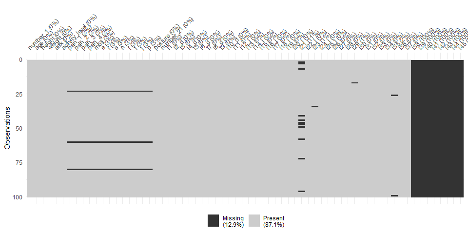
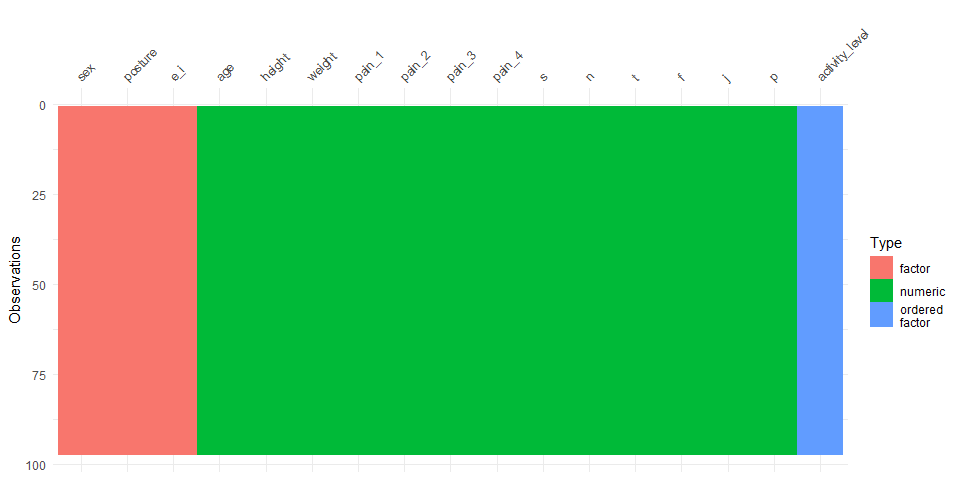

Posture Project
================
Giovani Gutierrez
2023-02-15

- <a href="#getting-started" id="toc-getting-started">Getting Started</a>
  - <a href="#setup" id="toc-setup">Setup</a>

# Getting Started

## Setup

``` r
library(tidyverse)
library(tidymodels)
library(readxl)
library(janitor)
library(visdat)
library(naniar)
tidymodels_prefer()

set.seed(123)  # set seed
```

``` r
data1 <- read_xls("C:/Users/giova/Desktop/PSTAT 131/predicting_personality/Data/Posture_Data.xls") %>%
    clean_names()

data1 %>%
    write.csv(file = "C:/Users/giova/Desktop/PSTAT 131/predicting_personality/Data/raw_data.csv")

head(data1)
```

    ## # A tibble: 6 × 66
    ##   number_1   age height weight sex    activi…¹ pain_1 pain_2 pain_3 pain_4 mbti 
    ##   <chr>    <dbl>  <dbl>  <dbl> <chr>  <chr>    <chr>  <chr>  <chr>  <chr>  <chr>
    ## 1 1           53     62    125 Female Low      0      0      0      0      ESFJ 
    ## 2 3           30     69    200 Male   High     0      0      0      0      ESTJ 
    ## 3 5           45     63    199 Female Moderate 4      5      2      2      ENFJ 
    ## 4 15          30     69    190 Male   Moderate 0      0      4      7      ESTP 
    ## 5 17          59     66    138 Female Low      6      3      6      6      ESTJ 
    ## 6 27          36     68    165 Male   High     0      2      0      0      ESTP 
    ## # … with 55 more variables: e <chr>, i <chr>, s <chr>, n <chr>, t <chr>,
    ## #   f <chr>, j <chr>, p <chr>, posture <chr>, number_21 <chr>, l1 <chr>,
    ## #   l2_d <chr>, l3 <chr>, l4_d <dbl>, l5 <chr>, l6_d <dbl>, l7 <chr>,
    ## #   l8_d <dbl>, l9 <chr>, l10_d <chr>, l11 <chr>, l12_i <dbl>, l13 <chr>,
    ## #   l14_i <chr>, l15 <chr>, l16_i <dbl>, l17 <chr>, l18_i <dbl>, l19 <chr>,
    ## #   l20_i <dbl>, l21 <chr>, l22_i <dbl>, l23 <chr>, l24_i <chr>, l25_i <dbl>,
    ## #   l26 <dbl>, l27 <dbl>, l28 <dbl>, l29 <chr>, l30 <chr>, l31 <dbl>, …

``` r
data1 <- data1 %>%
    replace_with_na_all(condition = ~.x == "X")

data1 %>%
    vis_miss()
```

<!-- -->

``` r
data1 <- data1 %>%
    select(age:posture & -mbti) %>%
    drop_na()

data1 <- data1 %>%
    mutate(sex = factor(sex)) %>%
    mutate(activity_level = ordered(activity_level, levels = c("Low", "Moderate",
        "High"))) %>%
    mutate_at(c("pain_1", "pain_2", "pain_3", "pain_4"), as.numeric) %>%
    mutate(e_i = factor(ifelse(e > i, "extrovert", "introvert"))) %>%
    mutate_at(c("s", "n", "t", "f", "j", "p"), as.numeric) %>%
    mutate(posture = factor(posture)) %>%
    select(-e & -i)

data1 %>%
    vis_dat()
```

<!-- -->

``` r
data1 %>%
    write.csv(file = "C:/Users/giova/Desktop/PSTAT 131/predicting_personality/Data/clean_data.csv")
```
