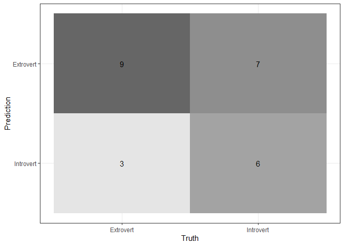

Posture Project
================
Giovani Gutierrez
2023-02-15

- <a href="#1-getting-started" id="toc-1-getting-started">1 Getting
  Started</a>
  - <a href="#11-setup" id="toc-11-setup">1.1 Setup</a>
  - <a href="#12-import-data" id="toc-12-import-data">1.2 Import Data</a>
  - <a href="#13-tidy-data--missing-values"
    id="toc-13-tidy-data--missing-values">1.3 Tidy Data &amp; Missing
    Values</a>
- <a href="#2-exploratory-data-analysis-eda"
  id="toc-2-exploratory-data-analysis-eda">2 Exploratory Data Analysis
  (EDA)</a>
  - <a href="#21-correlation-between-features"
    id="toc-21-correlation-between-features">2.1 Correlation Between
    Features</a>
  - <a href="#22-visual-eda" id="toc-22-visual-eda">2.2 Visual EDA</a>
- <a href="#3-model-setup" id="toc-3-model-setup">3 Model Setup</a>
  - <a href="#31-data-split--k-fold-cross-validation"
    id="toc-31-data-split--k-fold-cross-validation">3.1 Data Split &amp;
    <em>k</em>-Fold Cross Validation</a>
  - <a href="#32-recipe-building--workflow"
    id="toc-32-recipe-building--workflow">3.2 Recipe Building &amp;
    Workflow</a>
  - <a href="#33-model-specifications" id="toc-33-model-specifications">3.3
    Model Specifications</a>
    - <a href="#331-first-recipe-simple_rec"
      id="toc-331-first-recipe-simple_rec">3.3.1 First Recipe
      (<code>simple_rec</code>)</a>
    - <a href="#332-second-recipe-corr_rec"
      id="toc-332-second-recipe-corr_rec">3.3.2 Second Recipe
      (<code>corr_rec</code>)</a>
    - <a href="#333-third-recipe-pca_rec"
      id="toc-333-third-recipe-pca_rec">3.3.3 Third Recipe
      (<code>pca_rec</code>)</a>
- <a href="#4-model-tuning--evaluation"
  id="toc-4-model-tuning--evaluation">4 Model Tuning &amp; Evaluation</a>
  - <a href="#41-workflow-sets" id="toc-41-workflow-sets">4.1 Workflow
    Sets</a>
  - <a href="#42-workflow-map--tuning" id="toc-42-workflow-map--tuning">4.2
    Workflow Map &amp; Tuning</a>
  - <a href="#43-evaluation-of-models" id="toc-43-evaluation-of-models">4.3
    Evaluation of Models</a>
    - <a href="#431-linear-support-vector-machine"
      id="toc-431-linear-support-vector-machine">4.3.1 Linear Support Vector
      Machine</a>
    - <a href="#432-elastic-net-logistic-regression"
      id="toc-432-elastic-net-logistic-regression">4.3.2 Elastic Net Logistic
      Regression</a>

# 1 Getting Started

## 1.1 Setup

``` r
library(tidyverse)
library(tidymodels)
library(readxl)
library(janitor)
library(visdat)
library(naniar)
library(corrplot)
library(patchwork)
library(glmnet)
library(kknn)
library(ranger)
library(vip)
library(kernlab)
library(xgboost)
tidymodels_prefer()
theme_set(theme_bw())

set.seed(123)  # set seed
```

## 1.2 Import Data

``` r
data1 <- read_xls("C:/Users/giova/Desktop/PSTAT 131/predicting_personality/Data/Posture_Data.xls") %>%
    clean_names()  # read in raw data from .xls file

data1 %>%
    write.csv(file = "C:/Users/giova/Desktop/PSTAT 131/predicting_personality/Data/raw_data.csv")  # write raw data to .csv file

head(data1)  # preview data
```

<div data-pagedtable="false">

<script data-pagedtable-source type="application/json">
{"columns":[{"label":["number_1"],"name":[1],"type":["chr"],"align":["left"]},{"label":["age"],"name":[2],"type":["dbl"],"align":["right"]},{"label":["height"],"name":[3],"type":["dbl"],"align":["right"]},{"label":["weight"],"name":[4],"type":["dbl"],"align":["right"]},{"label":["sex"],"name":[5],"type":["chr"],"align":["left"]},{"label":["activity_level"],"name":[6],"type":["chr"],"align":["left"]},{"label":["pain_1"],"name":[7],"type":["chr"],"align":["left"]},{"label":["pain_2"],"name":[8],"type":["chr"],"align":["left"]},{"label":["pain_3"],"name":[9],"type":["chr"],"align":["left"]},{"label":["pain_4"],"name":[10],"type":["chr"],"align":["left"]},{"label":["mbti"],"name":[11],"type":["chr"],"align":["left"]},{"label":["e"],"name":[12],"type":["chr"],"align":["left"]},{"label":["i"],"name":[13],"type":["chr"],"align":["left"]},{"label":["s"],"name":[14],"type":["chr"],"align":["left"]},{"label":["n"],"name":[15],"type":["chr"],"align":["left"]},{"label":["t"],"name":[16],"type":["chr"],"align":["left"]},{"label":["f"],"name":[17],"type":["chr"],"align":["left"]},{"label":["j"],"name":[18],"type":["chr"],"align":["left"]},{"label":["p"],"name":[19],"type":["chr"],"align":["left"]},{"label":["posture"],"name":[20],"type":["chr"],"align":["left"]},{"label":["number_21"],"name":[21],"type":["chr"],"align":["left"]},{"label":["l1"],"name":[22],"type":["chr"],"align":["left"]},{"label":["l2_d"],"name":[23],"type":["chr"],"align":["left"]},{"label":["l3"],"name":[24],"type":["chr"],"align":["left"]},{"label":["l4_d"],"name":[25],"type":["dbl"],"align":["right"]},{"label":["l5"],"name":[26],"type":["chr"],"align":["left"]},{"label":["l6_d"],"name":[27],"type":["dbl"],"align":["right"]},{"label":["l7"],"name":[28],"type":["chr"],"align":["left"]},{"label":["l8_d"],"name":[29],"type":["dbl"],"align":["right"]},{"label":["l9"],"name":[30],"type":["chr"],"align":["left"]},{"label":["l10_d"],"name":[31],"type":["chr"],"align":["left"]},{"label":["l11"],"name":[32],"type":["chr"],"align":["left"]},{"label":["l12_i"],"name":[33],"type":["dbl"],"align":["right"]},{"label":["l13"],"name":[34],"type":["chr"],"align":["left"]},{"label":["l14_i"],"name":[35],"type":["chr"],"align":["left"]},{"label":["l15"],"name":[36],"type":["chr"],"align":["left"]},{"label":["l16_i"],"name":[37],"type":["dbl"],"align":["right"]},{"label":["l17"],"name":[38],"type":["chr"],"align":["left"]},{"label":["l18_i"],"name":[39],"type":["dbl"],"align":["right"]},{"label":["l19"],"name":[40],"type":["chr"],"align":["left"]},{"label":["l20_i"],"name":[41],"type":["dbl"],"align":["right"]},{"label":["l21"],"name":[42],"type":["chr"],"align":["left"]},{"label":["l22_i"],"name":[43],"type":["dbl"],"align":["right"]},{"label":["l23"],"name":[44],"type":["chr"],"align":["left"]},{"label":["l24_i"],"name":[45],"type":["chr"],"align":["left"]},{"label":["l25_i"],"name":[46],"type":["dbl"],"align":["right"]},{"label":["l26"],"name":[47],"type":["dbl"],"align":["right"]},{"label":["l27"],"name":[48],"type":["dbl"],"align":["right"]},{"label":["l28"],"name":[49],"type":["dbl"],"align":["right"]},{"label":["l29"],"name":[50],"type":["chr"],"align":["left"]},{"label":["l30"],"name":[51],"type":["chr"],"align":["left"]},{"label":["l31"],"name":[52],"type":["dbl"],"align":["right"]},{"label":["l32"],"name":[53],"type":["dbl"],"align":["right"]},{"label":["l33"],"name":[54],"type":["chr"],"align":["left"]},{"label":["l34"],"name":[55],"type":["dbl"],"align":["right"]},{"label":["l35"],"name":[56],"type":["chr"],"align":["left"]},{"label":["l36"],"name":[57],"type":["dbl"],"align":["right"]},{"label":["l37"],"name":[58],"type":["dbl"],"align":["right"]},{"label":["l38"],"name":[59],"type":["chr"],"align":["left"]},{"label":["l39"],"name":[60],"type":["chr"],"align":["left"]},{"label":["l40"],"name":[61],"type":["chr"],"align":["left"]},{"label":["l41"],"name":[62],"type":["chr"],"align":["left"]},{"label":["l42"],"name":[63],"type":["chr"],"align":["left"]},{"label":["l43"],"name":[64],"type":["chr"],"align":["left"]},{"label":["l44"],"name":[65],"type":["chr"],"align":["left"]},{"label":["l45"],"name":[66],"type":["chr"],"align":["left"]}],"data":[{"1":"1","2":"53","3":"62","4":"125","5":"Female","6":"Low","7":"0","8":"0","9":"0","10":"0","11":"ESFJ","12":"18","13":"3","14":"17","15":"9","16":"9","17":"13","18":"18","19":"4","20":"A","21":"1","22":"A","23":"4.7000000000000002","24":"A","25":"3.3","26":"A","27":"5.3","28":"P","29":"2.6","30":"A","31":"12.0","32":"A","33":"1.3","34":"A","35":"0.90000000000000002","36":"A","37":"0.0","38":"A","39":"0.5","40":"P","41":"0.5","42":"L","43":"0.5","44":"A","45":"0.59999999999999998","46":"0.8","47":"10.1","48":"0.4","49":"0.4","50":"P","51":"56.100000000000001","52":"12.6","53":"72.3","54":"0.29999999999999999","55":"2.1","56":"P","57":"364.10","58":"81.8","59":"NA","60":"NA","61":"NA","62":"NA","63":"NA","64":"NA","65":"NA","66":"NA"},{"1":"3","2":"30","3":"69","4":"200","5":"Male","6":"High","7":"0","8":"0","9":"0","10":"0","11":"ESTJ","12":"15","13":"6","14":"16","15":"10","16":"15","17":"9","18":"12","19":"10","20":"A","21":"3","22":"A","23":"27.300000000000001","24":"P","25":"5.2","26":"P","27":"0.3","28":"A","29":"3.8","30":"A","31":"12","32":"A","33":"2.7","34":"A","35":"0.0","36":"A","37":"1.4","38":"A","39":"0.9","40":"A","41":"1.0","42":"NA","43":"0.0","44":"A","45":"0.69999999999999996","46":"0.7","47":"16.2","48":"2.7","49":"4.9","50":"P","51":"194.80000000000001","52":"43.8","53":"115.6","54":"0.10000000000000001","55":"1.2","56":"A","57":"537.60","58":"120.8","59":"X","60":"NA","61":"NA","62":"NA","63":"NA","64":"NA","65":"NA","66":"NA"},{"1":"5","2":"45","3":"63","4":"199","5":"Female","6":"Moderate","7":"4","8":"5","9":"2","10":"2","11":"ENFJ","12":"14","13":"7","14":"20","15":"6","16":"9","17":"15","18":"16","19":"6","20":"A","21":"5","22":"A","23":"2.5","24":"A","25":"2.0","26":"A","27":"2.6","28":"A","29":"1.4","30":"A","31":"20.100000000000001","32":"A","33":"1.0","34":"A","35":"0.90000000000000002","36":"A","37":"0.3","38":"A","39":"1.0","40":"A","41":"0.3","42":"NA","43":"0.0","44":"A","45":"0.80000000000000004","46":"0.8","47":"16.1","48":"0.2","49":"0.3","50":"P","51":"79.900000000000006","52":"18.0","53":"115.0","54":"0","55":"0.4","56":"A","57":"520.10","58":"116.9","59":"NA","60":"NA","61":"NA","62":"NA","63":"NA","64":"X","65":"X","66":"X"},{"1":"15","2":"30","3":"69","4":"190","5":"Male","6":"Moderate","7":"0","8":"0","9":"4","10":"7","11":"ESTP","12":"20","13":"1","14":"22","15":"4","16":"13","17":"11","18":"7","19":"15","20":"A","21":"16","22":"A","23":"8.5","24":"A","25":"4.0","26":"A","27":"2.0","28":"P","29":"1.5","30":"A","31":"15.300000000000001","32":"A","33":"1.8","34":"A","35":"1.1000000000000001","36":"P","37":"0.0","38":"A","39":"0.1","40":"P","41":"0.3","42":"L","43":"0.1","44":"A","45":"0.5","46":"0.5","47":"15.4","48":"0.7","49":"1.1","50":"P","51":"96.090000000000003","52":"21.8","53":"109.8","54":"0.59999999999999998","55":"7.4","56":"P","57":"637.10","58":"143.2","59":"NA","60":"NA","61":"NA","62":"NA","63":"NA","64":"NA","65":"NA","66":"NA"},{"1":"17","2":"59","3":"66","4":"138","5":"Female","6":"Low","7":"6","8":"3","9":"6","10":"6","11":"ESTJ","12":"12","13":"9","14":"18","15":"8","16":"14","17":"10","18":"20","19":"2","20":"A","21":"19","22":"A","23":"0.5","24":"P","25":"1.1","26":"A","27":"0.3","28":"A","29":"4.0","30":"A","31":"12.1","32":"A","33":"0.4","34":"A","35":"0.40000000000000002","36":"A","37":"0.7","38":"A","39":"1.0","40":"A","41":"0.9","42":"L","43":"0.5","44":"A","45":"0.59999999999999998","46":"0.8","47":"11.2","48":"0.0","49":"0.1","50":"P","51":"51.100000000000001","52":"11.5","53":"79.8","54":"0.29999999999999999","55":"2.9","56":"A","57":"412.00","58":"92.6","59":"NA","60":"NA","61":"NA","62":"NA","63":"NA","64":"NA","65":"NA","66":"NA"},{"1":"27","2":"36","3":"68","4":"165","5":"Male","6":"High","7":"0","8":"2","9":"0","10":"0","11":"ESTP","12":"16","13":"5","14":"20","15":"6","16":"15","17":"9","18":"7","19":"15","20":"A","21":"29","22":"A","23":"14","24":"P","25":"2.6","26":"A","27":"1.6","28":"A","29":"1.0","30":"A","31":"14.199999999999999","32":"A","33":"1.2","34":"P","35":"0.10000000000000001","36":"A","37":"0.6","38":"A","39":"0.6","40":"A","41":"0.2","42":"L","43":"0.2","44":"A","45":"0.40000000000000002","46":"0.4","47":"13.4","48":"1.3","49":"1.9","50":"P","51":"107.59999999999999","52":"24.2","53":"95.4","54":"0.20000000000000001","55":"2.3","56":"A","57":"469.05","58":"105.5","59":"X","60":"NA","61":"NA","62":"NA","63":"NA","64":"NA","65":"NA","66":"NA"}],"options":{"columns":{"min":{},"max":[10]},"rows":{"min":[10],"max":[10]},"pages":{}}}
  </script>

</div>

## 1.3 Tidy Data & Missing Values

``` r
data1 <- data1 %>%
    replace_with_na_all(condition = ~.x == "X")  # replace 'X' character values with NA values

data1 %>%
    vis_miss()  # visualize missing values
```


``` r
data1 <- data1 %>%
    select(age:posture & -mbti) %>%
    drop_na()  # drop missing and irrelevant variables

data1 <- data1 %>%
    mutate(sex = factor(sex)) %>%
    mutate(activity_level = factor(activity_level)) %>%
    mutate_at(c("pain_1", "pain_2", "pain_3", "pain_4"), as.numeric) %>%
    mutate(e_i = factor(ifelse(e > i, "Extrovert", "Introvert"))) %>%
    mutate_at(c("s", "n", "t", "f", "j", "p"), as.numeric) %>%
    mutate(posture = factor(posture)) %>%
    select(-e & -i)  # coerce variables into appropriate type

data1 %>%
    vis_dat()  # visualize variable types
```


``` r
data1 %>%
    write.csv(file = "C:/Users/giova/Desktop/PSTAT 131/predicting_personality/Data/clean_data.csv")  # write clean data to .csv file

head(data1)  # preview cleaned data
```

<div data-pagedtable="false">

<script data-pagedtable-source type="application/json">
{"columns":[{"label":["age"],"name":[1],"type":["dbl"],"align":["right"]},{"label":["height"],"name":[2],"type":["dbl"],"align":["right"]},{"label":["weight"],"name":[3],"type":["dbl"],"align":["right"]},{"label":["sex"],"name":[4],"type":["fct"],"align":["left"]},{"label":["activity_level"],"name":[5],"type":["fct"],"align":["left"]},{"label":["pain_1"],"name":[6],"type":["dbl"],"align":["right"]},{"label":["pain_2"],"name":[7],"type":["dbl"],"align":["right"]},{"label":["pain_3"],"name":[8],"type":["dbl"],"align":["right"]},{"label":["pain_4"],"name":[9],"type":["dbl"],"align":["right"]},{"label":["s"],"name":[10],"type":["dbl"],"align":["right"]},{"label":["n"],"name":[11],"type":["dbl"],"align":["right"]},{"label":["t"],"name":[12],"type":["dbl"],"align":["right"]},{"label":["f"],"name":[13],"type":["dbl"],"align":["right"]},{"label":["j"],"name":[14],"type":["dbl"],"align":["right"]},{"label":["p"],"name":[15],"type":["dbl"],"align":["right"]},{"label":["posture"],"name":[16],"type":["fct"],"align":["left"]},{"label":["e_i"],"name":[17],"type":["fct"],"align":["left"]}],"data":[{"1":"53","2":"62","3":"125","4":"Female","5":"Low","6":"0","7":"0","8":"0","9":"0","10":"17","11":"9","12":"9","13":"13","14":"18","15":"4","16":"A","17":"Introvert"},{"1":"30","2":"69","3":"200","4":"Male","5":"High","6":"0","7":"0","8":"0","9":"0","10":"16","11":"10","12":"15","13":"9","14":"12","15":"10","16":"A","17":"Introvert"},{"1":"45","2":"63","3":"199","4":"Female","5":"Moderate","6":"4","7":"5","8":"2","9":"2","10":"20","11":"6","12":"9","13":"15","14":"16","15":"6","16":"A","17":"Introvert"},{"1":"30","2":"69","3":"190","4":"Male","5":"Moderate","6":"0","7":"0","8":"4","9":"7","10":"22","11":"4","12":"13","13":"11","14":"7","15":"15","16":"A","17":"Extrovert"},{"1":"59","2":"66","3":"138","4":"Female","5":"Low","6":"6","7":"3","8":"6","9":"6","10":"18","11":"8","12":"14","13":"10","14":"20","15":"2","16":"A","17":"Introvert"},{"1":"36","2":"68","3":"165","4":"Male","5":"High","6":"0","7":"2","8":"0","9":"0","10":"20","11":"6","12":"15","13":"9","14":"7","15":"15","16":"A","17":"Introvert"}],"options":{"columns":{"min":{},"max":[10]},"rows":{"min":[10],"max":[10]},"pages":{}}}
  </script>

</div>

- `age`: Age of participant (in years)
- `height`: Height of participant (in inches)
- `weight`: Weight of participant (in pounds)
- `sex`: Sex of the participant (male or female)
- `activity_level`: Amount of daily physical activity performed by a
  participant (low, moderate, or high)
- `pain_1`: Pain in the neck reported on a scale from 0 (low) to 10
  (high) by a participant
- `pain_2`: Pain in the thoracic reported on a scale from 0 (low) to 10
  (high) by a participant
- `pain_3`: Pain in the lumbar reported on a scale from 0 (low) to 10
  (high) by the participant
- `pain_4`: Pain in the sacrum reported on a scale from 0 (low) to 10
  (high) by the participant
- `s`: A participant’s sensing characteristic on a scale from 1 (low) to
  26 (high)
- `i`: A participant’s intuition characteristic on a scale from 1 (low)
  to 26 (high)
- `t`: A participant’s thinking characteristic on a scale from 1 (low)
  to 26 (high)
- `f`: A participant’s feeling characteristic on a scale from 1 (low) to
  26 (high)
- `j`: A participant’s judging characteristic on a scale from 1 (low) to
  26 (high)
- `p`: A participant’s perceiving characteristic on a scale from 1 (low)
  to 26 (high)
- `posture`: Type of posture exhibited by a participant (ideal posture
  (A), kyphosis-lordosis (B), flat-back (C), and sway-back (D))
- `e_i`: Categorization of participant as an extrovert or introvert;
  based on whichever score was higher on their MBTI questionnaire

# 2 Exploratory Data Analysis (EDA)

## 2.1 Correlation Between Features

``` r
tmwr_cols <- colorRampPalette(c("#91CBD765", "#CA225E"))

data1 %>%
    select_if(is.numeric) %>%
    cor() %>%
    corrplot(col = tmwr_cols(200), tl.col = "black", method = "circle", type = "lower",
        diag = FALSE)
```


## 2.2 Visual EDA

``` r
ggplot(data = data1, aes(fill = e_i, x = e_i)) + geom_bar(colour = "black") + scale_fill_brewer(palette = "Pastel1") +
    guides(fill = FALSE) + labs(x = NULL, y = "Number of Participants")
```


``` r
ggplot(data = data1, aes(fill = sex, x = e_i)) + geom_bar(position = "fill", colour = "black") +
    scale_fill_brewer(palette = "Pastel1") + labs(x = NULL, y = "Proportion of Participants",
    fill = "Sex")
```


``` r
ggplot(data = data1, aes(fill = posture, x = e_i)) + geom_bar(position = "fill",
    colour = "black") + scale_fill_brewer(palette = "Pastel1") + labs(x = NULL, y = "Proportion of Participants",
    fill = "Posture Type")
```


``` r
ggplot(data = data1, aes(fill = activity_level, x = posture)) + geom_bar(position = "fill",
    colour = "black") + labs(x = "Posture Type", fill = "Activity Level") + facet_grid(. ~
    e_i) + scale_fill_brewer(palette = "Pastel1") + labs(y = "Proportion of Participants",
    fill = "Activity Level")
```


``` r
ggplot(data = data.frame(data1, transmute(data1, s_n = factor(ifelse(s > n, "sensing",
    "inuitive")))), aes(x = e_i, fill = s_n)) + geom_bar(position = "fill", colour = "black") +
    scale_fill_brewer(palette = "Pastel1") + labs(x = "", y = "Proportion of Participants",
    fill = NULL)
```


``` r
ggplot(data = data.frame(data1, transmute(data1, t_f = factor(ifelse(t > f, "thinking",
    "feeling")))), aes(x = e_i, fill = t_f)) + geom_bar(position = "fill", colour = "black") +
    scale_fill_brewer(palette = "Pastel1") + labs(x = NULL, y = "Proportion of Participants",
    fill = NULL)
```


``` r
ggplot(data = data.frame(data1, transmute(data1, j_p = factor(ifelse(j > p, "judging",
    "perceiving")))), aes(x = e_i, fill = j_p)) + geom_bar(position = "fill", color = "black") +
    scale_fill_brewer(palette = "Pastel1") + labs(x = NULL, y = "Proportion of Participants",
    fill = NULL)
```


``` r
p1 <- ggplot(data = data1, aes(x = posture, y = pain_1, fill = posture)) + geom_boxplot(color = "black") +
    stat_summary(fun.y = "mean", geom = "point", shape = 23, size = 3, fill = "white") +
    scale_fill_brewer(palette = "Pastel1") + labs(x = "Posture Type", y = "Level of Neck Pain") +
    guides(fill = FALSE)

p2 <- ggplot(data = data1, aes(x = posture, y = pain_2, fill = posture)) + geom_boxplot(color = "black") +
    stat_summary(fun.y = "mean", geom = "point", shape = 23, size = 3, fill = "white") +
    scale_fill_brewer(palette = "Pastel1") + labs(x = "Posture Type", y = "Level of Thoracic Pain") +
    guides(fill = FALSE)

p3 <- ggplot(data = data1, aes(x = posture, y = pain_3, fill = posture)) + geom_boxplot(color = "black") +
    stat_summary(fun.y = "mean", geom = "point", shape = 23, size = 3, fill = "white") +
    scale_fill_brewer(palette = "Pastel1") + labs(x = "Posture Type", y = "Level of Lumbar Pain") +
    guides(fill = FALSE)

p4 <- ggplot(data = data1, aes(x = posture, y = pain_4, fill = posture)) + geom_boxplot(color = "black") +
    stat_summary(fun.y = "mean", geom = "point", shape = 23, size = 3, fill = "white") +
    scale_fill_brewer(palette = "Pastel1") + labs(x = "Posture Type", y = "Level of Sacral Pain") +
    guides(fill = FALSE)

p1 + p2 + p3 + p4
```


# 3 Model Setup

## 3.1 Data Split & *k*-Fold Cross Validation

``` r
person_split <- initial_split(data = data1, prop = 0.8, strata = e_i)  # initial split

person_train <- training(person_split)  # training set
person_test <- testing(person_split)  # testing set

person_folds <- vfold_cv(person_train, v = 10, strata = e_i)  # 10-fold cross validation
```

## 3.2 Recipe Building & Workflow

``` r
simple_rec <- recipe(e_i ~ ., data = person_train)

corr_rec <- simple_rec %>%
    step_corr(all_numeric_predictors(), threshold = tune()) %>%
    step_normalize(all_numeric_predictors()) %>%
    step_dummy(all_nominal_predictors())

pca_rec <- simple_rec %>%
    step_corr(all_numeric_predictors(), threshold = tune()) %>%
    step_zv(all_numeric_predictors()) %>%
    step_normalize(all_numeric_predictors()) %>%
    step_YeoJohnson(all_numeric_predictors()) %>%
    step_pca(all_numeric_predictors(), num_comp = tune()) %>%
    step_dummy(all_nominal_predictors())
```

## 3.3 Model Specifications

### 3.3.1 First Recipe (`simple_rec`)

#### 3.3.1.1 Random Forest

``` r
forest_spec <- rand_forest(mtry = tune(), min_n = tune(), trees = tune()) %>%
    set_mode("classification") %>%
    set_engine("ranger", importance = "impurity")
```

### 3.3.2 Second Recipe (`corr_rec`)

#### 3.3.2.1 K-Nearest Neighbors

``` r
knn_spec <- nearest_neighbor(neighbors = tune()) %>%
    set_mode("classification") %>%
    set_engine("kknn")
```

#### 3.3.2.2 Logistic Regression

``` r
log_spec <- logistic_reg(penalty = tune(), mixture = tune()) %>%
    set_mode("classification") %>%
    set_engine("glmnet")
```

### 3.3.3 Third Recipe (`pca_rec`)

#### 3.3.3.1 Support Vector Machine

``` r
svm_spec <- svm_linear(cost = tune(), margin = tune()) %>%
    set_mode("classification") %>%
    set_engine("kernlab")
```

# 4 Model Tuning & Evaluation

## 4.1 Workflow Sets

``` r
simple_wf <- workflow_set(preproc = list(simple = simple_rec), models = list(random_forest = forest_spec))

corr_wf <- workflow_set(preproc = list(corr = corr_rec), models = list(knn = knn_spec,
    log_reg = log_spec))

pca_wf <- workflow_set(preproc = list(pca = pca_rec), models = list(log_reg = log_spec,
    svm = svm_spec))
```

## 4.2 Workflow Map & Tuning

``` r
all_workflows <- bind_rows(simple_wf, corr_wf, pca_wf)

grid_ctrl <- control_grid(save_pred = TRUE, parallel_over = "everything", save_workflow = TRUE)

grid_results <- all_workflows %>%
    workflow_map(seed = 123, resamples = person_folds, grid = 8, control = grid_ctrl)

grid_results %>%
    write_rds("C:/Users/giova/Desktop/PSTAT 131/predicting_personality/predicting_personality_files/Models/tuned_grid.rds")
```

## 4.3 Evaluation of Models

``` r
grid_results <- read_rds(file = "C:/Users/giova/Desktop/PSTAT 131/predicting_personality/predicting_personality_files/Models/tuned_grid.rds")

autoplot(grid_results, rank_metric = "roc_auc", metric = "roc_auc", select_best = TRUE) +
    geom_text(aes(y = 0.2, label = wflow_id), angle = 90, hjust = 0) + theme(legend.position = "none")
```


### 4.3.1 Linear Support Vector Machine

``` r
autoplot(grid_results, id = "pca_svm", metric = "roc_auc")
```



### 4.3.2 Elastic Net Logistic Regression

``` r
autoplot(grid_results, id = "pca_log_reg", metric = "roc_auc")
```


